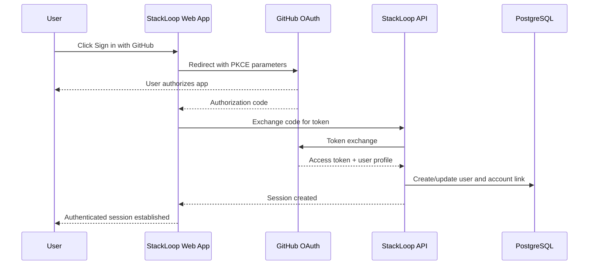
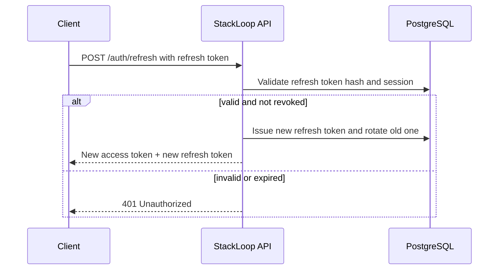
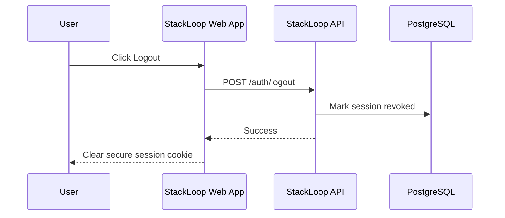
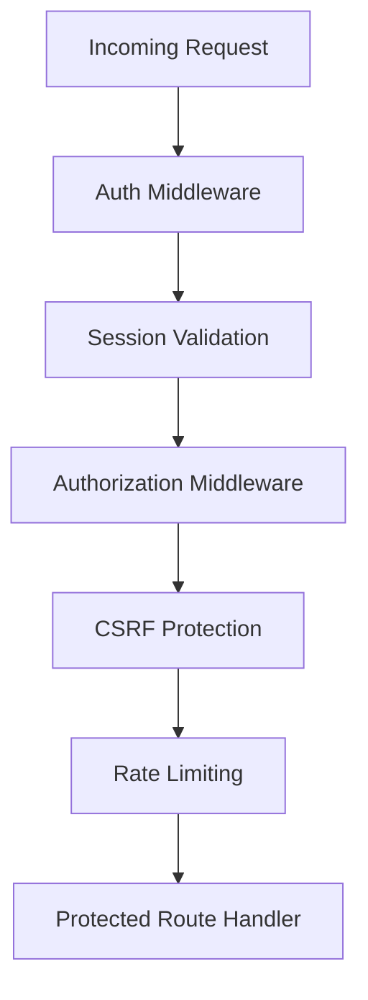
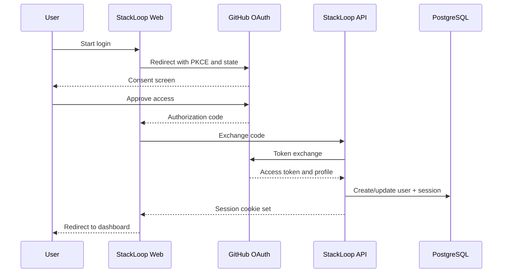
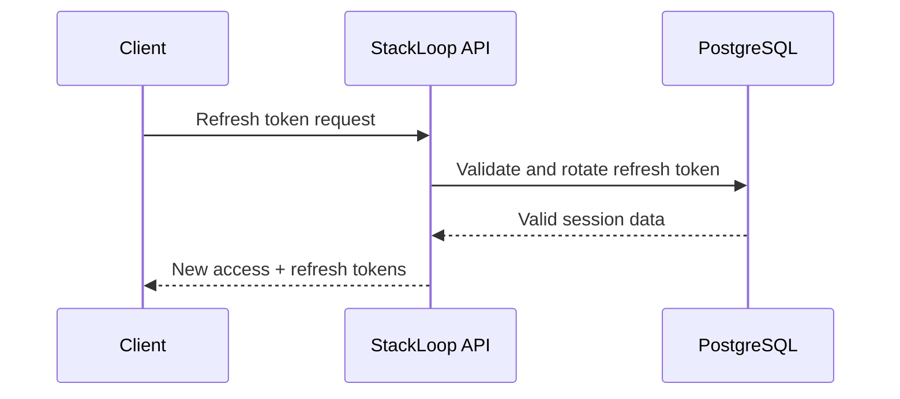
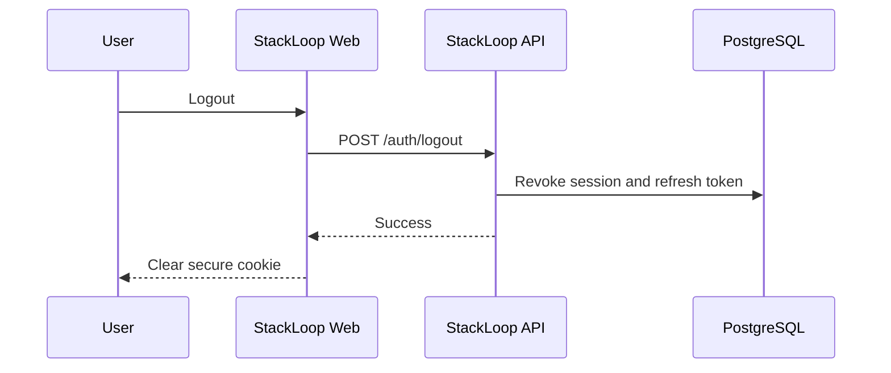

# StackLoop Authentication and Authorization Specification

## 1. Security Goals

StackLoop must provide a secure, modern authentication experience for developers while supporting GitHub OAuth, session-based web access, API access, and future client integrations.

### Primary Security Objectives
- Follow OAuth 2.1 best practices
- Prevent CSRF and token theft
- Support short-lived access tokens and rotation-friendly refresh tokens
- Provide least-privilege authorization
- Protect both browser and API workflows
- Support future growth into organizations, teams, and admins

---

## 2. Authentication Model

### Core Authentication Mechanisms
- GitHub OAuth 2.1 for user sign-in
- Short-lived access tokens for API requests
- Refresh tokens for renewing access tokens securely
- HttpOnly, Secure, SameSite cookies for browser sessions
- Optional bearer tokens for non-browser clients

### Recommended Auth Flow
1. User clicks Sign in with GitHub
2. StackLoop redirects to GitHub authorization endpoint
3. GitHub authenticates the user and returns an authorization code
4. StackLoop exchanges that code for an access token and user profile
5. StackLoop creates or updates the user account and issues a session
6. The app stores a secure session cookie and returns the user to the requested page

---

## 3. OAuth 2.1 Login Flow

### Flow Overview


### OAuth Requirements
- Use authorization code flow with PKCE
- Do not use implicit flow
- Do not exchange tokens in query strings without protection
- Use state parameter to prevent CSRF during redirect
- Use nonce or state to correlate request initiation and callback

### OAuth Parameters
- client_id
- redirect_uri
- response_type=code
- scope=read:user,user:email
- state=random opaque value
- code_challenge and code_challenge_method=S256
- code_verifier in the token exchange step

### Why This Is Secure
- PKCE prevents interception and code injection attacks
- State ensures the callback belongs to the current login attempt
- GitHub handles the user identity source, reducing custom credential handling

---

## 4. OAuth Callback Handling

### Callback Flow
- The callback endpoint receives the authorization code and state
- It validates the state value against the server-side session or signed cookie
- It exchanges the code for a token at GitHub
- It fetches the GitHub user profile and email data
- It creates or links the account to the existing StackLoop user
- It creates the app session and redirects the user to the post-login route

### Recommended Callback Endpoint
```text
GET /auth/github/callback
```

### Callback Security Checks
- Validate state parameter before exchanging the code
- Validate redirect URI matches the registered URI
- Use HTTPS only
- Reject reused authorization codes
- Store transient OAuth state in server-side store or signed cookie

---

## 5. Session Management

### Session Model
StackLoop should use server-managed browser sessions with secure cookies for the web app and short-lived access tokens for APIs.

### Browser Session Strategy
- Create a server-side session record with:
  - session id
  - user id
  - issued at
  - expires at
  - last activity at
  - revoked at
  - user agent and IP fingerprint

### Cookie Strategy
- Set cookies as HttpOnly, Secure, SameSite=Lax or Strict
- Use a dedicated session cookie such as:
  - stackloop_session
- Do not store access tokens directly in browser-localStorage

### Cookie Attributes
```text
Set-Cookie: stackloop_session=<session_id>; HttpOnly; Secure; SameSite=Lax; Path=/; Max-Age=86400
```

### Why Cookie Storage Is Preferred
- Protects tokens from XSS-based theft
- Prevents accidental exposure to scripts
- Fits the browser-based session model well

### Session Storage
- Session records should be stored in PostgreSQL or a dedicated session store
- Redis can be used for fast session lookup and expiry management
- The session record should support revocation and rotation

---

## 6. Access Tokens and Refresh Tokens

### Token Strategy
- Access tokens: short-lived, e.g. 15 minutes
- Refresh tokens: long-lived, e.g. 30 days
- Rotate refresh tokens on each use
- Revoke refresh tokens when a session is logged out or suspicious activity occurs

### Recommended Token Properties
- JWT or opaque token format depending on service needs
- If JWT is used, keep claims minimal and signed with asymmetric keys
- If opaque tokens are used, store token metadata in the database and use a random token ID

### JWT Strategy
If JWTs are used, the recommended approach is:
- Use asymmetric signing (RS256 or ES256)
- Keep claims minimal:
  - sub: user id
  - role: user role
  - scope: delegated permissions
  - exp: expiry time
  - iat: issued at
  - jti: unique token id
- Do not embed sensitive information in claims
- Rotate signing keys over time

### JWT Validation Rules
- Verify signature and expiration
- Reject tokens with missing or invalid issuer/audience
- Use server-side revocation support if the token is part of a session model

### Access Token Storage
- Browser-based web sessions: store only the session cookie; do not expose access tokens to JavaScript
- API clients: use secure storage such as OS keychain or encrypted secret storage
- Do not store bearer tokens in localStorage for web apps

### Refresh Token Storage
- Store refresh token hashes in the database, not in plaintext
- Store only the hashed value and metadata such as expiry and revocation status

---

## 7. Refresh Token Flow



### Refresh Token Rules
- Rotate on every use
- Revoke the old token immediately after replacement
- Expire refresh tokens after inactivity or after a maximum lifetime
- Limit refresh token reuse to prevent replay attacks
- If a refresh token is reused, revoke the entire session chain and force re-login

---

## 8. Logout Flow

### Browser Logout Flow


### Logout Requirements
- Invalidate the current session record
- Revoke refresh tokens linked to that session
- Clear the session cookie from the browser
- If using JWTs, make sure token revocation is supported or use short expiry and a revocation list

---

## 9. Role Management

### Roles
- user: default role for authenticated users
- maintainer: user with repository ownership or verification responsibilities
- admin: platform administrator with elevated capabilities
- moderator: optional future role for content moderation

### Role Model
```text
user < maintainer < admin
```

### Role Assignment Rules
- Users receive the user role by default after GitHub account verification
- Maintainer role is granted when the user claims or verifies a repository
- Admin role is granted only by existing admins or secure provisioning workflows

### Role Storage
- Roles should be stored in the users table or a dedicated roles table
- For flexibility, a dedicated user_roles table is recommended for future expansion

### Suggested Role Table
```sql
CREATE TABLE user_roles (
    user_id UUID NOT NULL REFERENCES users(id) ON DELETE CASCADE,
    role VARCHAR(50) NOT NULL,
    granted_at TIMESTAMPTZ NOT NULL DEFAULT now(),
    granted_by UUID REFERENCES users(id) ON DELETE SET NULL,
    PRIMARY KEY (user_id, role)
);
```

---

## 10. Permission Model

### Permission Strategy
Use a role-based access control model with resource-specific permissions.

### Core Permission Types
- repository.read
- repository.write
- repository.manage
- collection.create
- collection.manage
- recommendation.read
- notification.read
- admin.user.manage
- admin.repo.verify
- admin.search.reindex

### Permission Evaluation
- Authorization should be checked at the route or service layer
- Permission checks should be explicit and centralized
- Every protected route should require a permission or role check

### Policy Example
```text
admin -> all admin permissions
maintainer -> repository.manage for owned repositories
user -> repository.read, collection.create, notification.read
```

### Why This Is Secure
- Least privilege is enforced by design
- Permission logic is easier to audit and evolve over time

---

## 11. Protected Routes and Middleware

### Middleware Layers
1. Authentication middleware
   - Verifies access token or session cookie
   - Loads the current user into request context
2. Authorization middleware
   - Verifies required role or permission
3. CSRF middleware
   - Protects state-changing requests for browser sessions
4. Rate limiting middleware
   - Prevents brute-force and abuse
5. Audit middleware
   - Logs security-sensitive actions

### Middleware Flow


### Protected Route Examples
- /repositories/{id} PATCH
- /collections POST
- /saved-repositories POST
- /notifications PATCH
- /admin/* routes

### Middleware Responsibilities
- Reject missing or invalid credentials
- Enforce role and permission checks
- Abort on suspicious or malformed requests
- Add user context to the request for downstream services

---

## 12. CSRF Protection

### Why CSRF Matters
A browser-based attacker could trick a logged-in user into submitting a state-changing request to StackLoop without the user intending it.

### Recommended Protection
- Use SameSite=Lax or Strict on session cookies
- Use CSRF tokens for state-changing non-GET requests where the site uses cookie-based auth
- For APIs consumed by browsers, include an X-CSRF-Token header or double-submit cookie pattern

### Recommended Implementation
- For browser-based forms and mutations, issue a CSRF token in a cookie and require it in a header for POST, PATCH, DELETE requests
- Validate the token server-side on every state-changing request

### CSRF Protection Example
```text
POST /collections
X-CSRF-Token: <token>
Cookie: stackloop_session=<session>; csrf_token=<token>
```

### Why This Is Secure
- Prevents cross-site form submission attacks
- Keeps browser-based auth flows consistent with security best practices

---

## 13. Token Storage and Handling

### Browser Storage Rules
- Do not store access tokens in localStorage or sessionStorage
- Store session cookies only
- Use HttpOnly to reduce XSS risk
- Use Secure to ensure transport security
- Use SameSite=Lax/Strict to reduce CSRF exposure

### API Client Storage Rules
- For server-to-server clients, store tokens in secure secret storage
- For desktop/mobile apps, use OS secure storage if possible
- Never log tokens or leave them in environment variables in source code

### Token Lifecycle
- Access tokens expire quickly
- Refresh tokens can be rotated and revoked
- Session cookies should also expire after inactivity or absolute max age

---

## 14. Session Expiration and Inactivity

### Recommended Timeouts
- Session cookie lifetime: 24 hours or configurable
- Idle timeout: 8 hours or 12 hours
- Access token lifetime: 15 minutes
- Refresh token lifetime: 30 days

### Inactivity Strategy
- Extend the session only on activity if the user remains active
- If a user is inactive for too long, require re-authentication

### Renewal Policy
- Refresh tokens may be rotated on use and invalidated on suspicious behavior
- Sessions should be invalidated on logout or password/account change events

### Security Benefit
- Short-lived sessions reduce the blast radius of token leakage
- Inactivity timeouts reduce long-lived unauthorized access exposure

---

## 15. Account Linking

### Account Linking Strategy
StackLoop should support linking GitHub accounts to a single StackLoop account.

### Linking Rules
- If the user signs in with GitHub and no existing StackLoop account exists, create the account
- If the user already has a StackLoop account, link the GitHub identity to that account and merge profile data where appropriate
- If the GitHub account is already linked to another user, require a secure confirmation or admin intervention

### Account Linking Table
```sql
CREATE TABLE account_links (
    id UUID PRIMARY KEY DEFAULT gen_random_uuid(),
    user_id UUID NOT NULL REFERENCES users(id) ON DELETE CASCADE,
    provider VARCHAR(50) NOT NULL,
    provider_user_id VARCHAR(255) NOT NULL,
    email VARCHAR(320),
    linked_at TIMESTAMPTZ NOT NULL DEFAULT now(),
    UNIQUE (provider, provider_user_id)
);
```

### Security Benefit
- Prevents identity conflicts
- Makes multi-provider login manageable and auditable

---

## 16. Sequence Diagrams

### 16.1 GitHub OAuth Login


### 16.2 Token Refresh


### 16.3 Logout


---

## 17. Security Controls and Best Practices

### Required Controls
- HTTPS only in production
- HSTS enabled
- Secure cookie flags
- CSRF tokens for cookie-based browser mutations
- Rate limiting for login and token endpoints
- Audit logging for auth events
- Secure storage of refresh tokens and OAuth state values
- Monitoring for suspicious login patterns

### Recommended Protections
- Re-authentication for sensitive admin actions
- IP-based anomaly detection for unusual login locations
- Device or session fingerprinting for suspicious activity
- User notification on new login location or device

### Logging Requirements
Log the following:
- sign-in success/failure
- logout events
- token refresh events
- session revocations
- failed permission checks
- suspicious or repeated auth failures

---

## 18. Production Implementation Notes

### Recommended Middleware Order
1. Trust proxy / HTTPS enforcement
2. CSRF protection
3. Authentication middleware
4. Authorization middleware
5. Rate limiting
6. Audit logging

### Recommended Storage Layers
- Session table in PostgreSQL for durable session state
- Redis for fast session lookup and caching if required
- Refresh token hashes in PostgreSQL

### Recommended Security Defaults
- Access token TTL: 15 minutes
- Refresh token TTL: 30 days
- Session idle timeout: 8 hours
- Max concurrent sessions per user: configurable, default 5

---

## 19. Summary

StackLoop’s authentication system should be built around GitHub OAuth 2.1, secure session cookies, short-lived access tokens, rotated refresh tokens, clear role-based authorization, and strong CSRF and audit protections. This model is appropriate for a secure, modern, developer-first platform and can scale to an enterprise-style product without exposing the user to unnecessary complexity.
