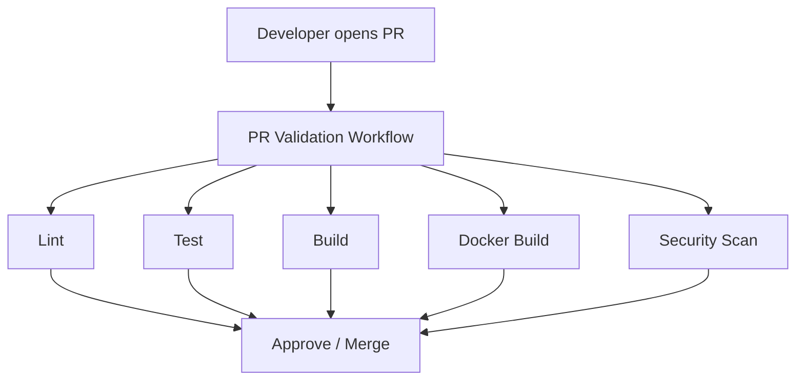
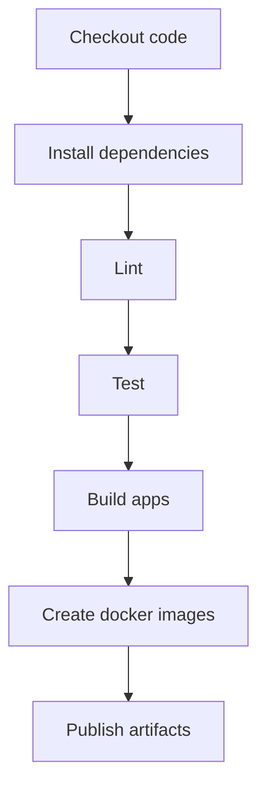
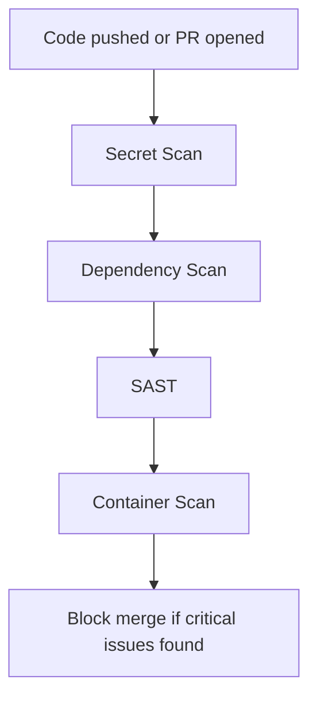
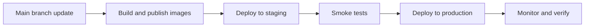
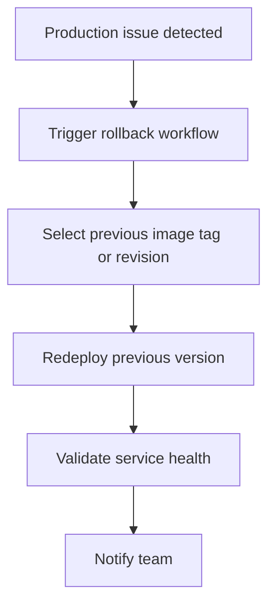
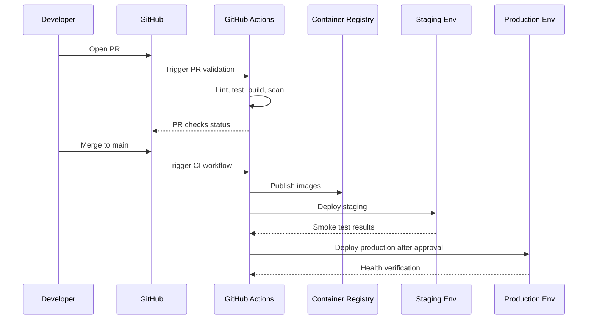

# StackLoop CI/CD Pipeline Specification

## 1. Purpose

This document defines a production-ready CI/CD architecture for StackLoop using GitHub Actions. It covers branch strategy, pull request validation, linting, testing, container builds, security scanning, environment promotion, release automation, secrets management, rollback, and notifications.

---

## 2. CI/CD Goals

The pipeline must support:

- Fast and reliable validation for every change
- Clear quality gates before deployment
- Safe promotion from development to production
- Container-based deployments for web, API, and worker services
- Strong security checks before release
- Simple rollback and incident response

---

## 3. Recommended GitHub Actions Structure

### Repository Structure

```text
.github/
  workflows/
    pr-validation.yml
    ci-main.yml
    release.yml
    deploy-prod.yml
    rollback.yml
    security-scan.yml
```

### Workflow Responsibilities

- pr-validation.yml
  - Runs on pull requests
  - Executes linting, unit tests, type checks, and build validation

- ci-main.yml
  - Runs on pushes to main
  - Builds and validates the full monorepo

- security-scan.yml
  - Runs static analysis, dependency scanning, container image scanning, and secret detection

- release.yml
  - Creates versioned releases and tags
  - Builds immutable images for release candidates

- deploy-prod.yml
  - Deploys validated artifacts to production

- rollback.yml
  - Reverts a known-bad deployment safely

---

## 4. Branch Strategy

### Recommended Branch Model

- main
  - Production-ready code
  - Protected branch
  - Only merged through pull requests

- develop
  - Integration branch for ongoing work
  - Optional, useful if the team wants a staged integration branch

- feature/*
  - Short-lived branches for new work

- hotfix/*
  - Emergency fixes for production issues

- release/*
  - Optional release preparation branches

### Branch Protection Rules

Protect main with:
- required pull request reviews
- required status checks
- no direct pushes
- dismiss stale approvals on new commits
- require conversation resolution

---

## 5. Pull Request Workflow

### Purpose
Every pull request should automatically validate the change before it can merge.

### Workflow Trigger
- Pull requests targeting main or develop

### Included Checks
- linting
- type checking
- unit tests
- integration tests where applicable
- build validation for web, API, and AI services
- docker build validation
- dependency security scan

### PR Workflow Diagram



### PR Workflow Explanation
This workflow ensures that the change is safe before it enters the main branch. It is the first line of defense against regressions and bad deployments.

---

## 6. Linting and Static Quality Checks

### Recommended Tools
- ESLint for frontend and Node-based code
- Prettier for formatting consistency
- TypeScript compiler checks
- Python linting for the AI service if used
- Shellcheck for scripts where applicable

### Linting Policy
- Fail the build on warnings if they are treated as errors in CI
- Enforce formatting and import order where relevant

### Why It Matters
Linting reduces review overhead and ensures consistent code quality across the repository.

---

## 7. Testing Strategy

### Test Levels

1. Unit Tests
   - Fast, local logic validation
   - Run on every PR and main branch push

2. Integration Tests
   - Validate service-to-service and database interactions
   - Run in a test environment where dependencies are available

3. End-to-End Tests
   - Validate critical user flows such as authentication, repository discovery, and contribution flows
   - Run nightly or on release branches

### Recommended Test Execution Matrix

| Test Type | Trigger | Purpose |
| --- | --- | --- |
| Unit tests | PR, main push | Fast regression safety |
| Integration tests | PR, main push | Service interaction validation |
| E2E tests | Release branch / nightly | Critical user journey validation |

### Test Environment
- Use ephemeral test services where possible
- Seed data for repeatable test runs
- Isolate tests from production data

---

## 8. Build Workflow

### Build Responsibilities
- Install dependencies with package manager
- Build the web app, API service, and any shared packages
- Validate that the app compiles successfully
- Generate build artifacts for deployment

### Recommended Build Order
1. Install dependencies
2. Run linting
3. Run tests
4. Build frontend and backend artifacts
5. Package Docker images

### Build Diagram



---

## 9. Docker Build and Image Strategy

### Docker Build Goals
- Ensure every service can be built successfully in CI
- Produce immutable images for deployment
- Attach meaningful metadata such as commit SHA and semantic version

### Image Naming Strategy

```text
ghcr.io/<owner>/stackloop-web:<tag>
ghcr.io/<owner>/stackloop-api:<tag>
ghcr.io/<owner>/stackloop-worker:<tag>
```

### Recommended Tags
- sha-<commit>
- latest for main branch builds
- semver tags for releases

### Container Security
- Build images using pinned base images where possible
- Avoid running as root
- Scan images for vulnerabilities before deployment

---

## 10. Security Scanning

### Security Checks
- Dependency vulnerability scanning
- Static application security testing
- Secret detection
- Container image scanning
- SAST for code and infrastructure files

### Recommended Tools
- GitHub Advanced Security
- Trivy
- Gitleaks
- CodeQL
- Dependabot

### Security Workflow Diagram



### Security Policy
- Critical vulnerabilities block deployment
- High vulnerabilities should be reviewed and triaged
- Security findings should be visible in the GitHub security tab

---

## 11. Deployment Workflow

### Deployment Model
Deployments should be environment-aware and controlled.

### Environments
- development
- staging
- production

### Production Deployment Flow
1. Merge validated changes to main
2. CI workflow builds and publishes images
3. Release workflow creates versioned artifacts
4. Deployment workflow promotes the release to staging
5. After validation, promote to production

### Deployment Diagram



### Deployment Explanation
This approach reduces risk by validating the change in lower-risk environments before production exposure.

---

## 12. Release Automation

### Release Strategy
StackLoop should use semantic versioning.

Recommended versioning scheme:
- major.minor.patch

Examples:
- 1.0.0
- 1.2.3

### Release Automation Rules
- Tag releases on main after successful validation
- Generate release notes from merged pull requests
- Publish deployment artifacts and container images with the same version
- Keep release history consistent and auditable

### Suggested Release Trigger
- Manual workflow dispatch or merge to main with a release label

---

## 13. Secrets Management

### Secrets Sources
Use GitHub Actions secrets or GitHub environment secrets for:
- Azure credentials
- container registry credentials
- deployment tokens
- database credentials
- third-party API keys

### Best Practices
- Never hardcode secrets into workflows or source code
- Use environment-scoped secrets for staging and production
- Rotate secrets regularly
- Use short-lived credentials where possible

### Recommended Secret Structure
- repo-level secrets for shared non-sensitive automation
- environment-level secrets for prod-specific deployment credentials

---

## 14. Environment Promotion

### Promotion Model
Use a staged promotion model:

1. Pull request validation
2. Main branch CI validation
3. Staging deployment
4. Smoke testing
5. Production deployment

### Promotion Controls
- Require manual approval for production deployment
- Use environment protection rules in GitHub Actions
- Allow automatic promotion to staging
- Require approval for production promotion

### Why This is Safe
It creates a clear path from change to deployment while reducing the chance of accidental production release.

---

## 15. Rollback Strategy

### Rollback Goal
Roll back fast when a deployment introduces a regression or outage.

### Rollback Mechanisms
- Redeploy the previous known-good container image tag
- Revert the application revision in Azure Container Apps
- Revert the GitHub release tag if needed
- Keep previous container images available for immediate rollback

### Rollback Workflow



### Rollback Best Practices
- Keep previous releases tagged and available
- Document rollback commands and approval steps
- Test rollback procedures periodically

---

## 16. Notifications

### Notification Channels
- GitHub PR checks
- Slack or Microsoft Teams notifications for build and deployment outcomes
- Email alerts for production failures

### Recommended Triggers
- PR validation failed
- Production deployment succeeded or failed
- Security scan found critical issues
- Rollback executed

### Notification Design
- Notify the engineering team on failure
- Notify release owners on successful deployment
- Keep notifications concise and actionable

---

## 17. Recommended GitHub Actions Workflow Files

### 1. PR Validation Workflow
Trigger: pull_request
Responsibilities:
- checkout
- install dependencies
- lint
- test
- build
- docker build validation
- security scan

### 2. Main CI Workflow
Trigger: push to main
Responsibilities:
- run the same validation suite
- publish images to container registry
- create build metadata

### 3. Release Workflow
Trigger: workflow_dispatch or tag push
Responsibilities:
- version generation
- image tagging
- release notes generation
- deployment metadata publication

### 4. Staging Deployment Workflow
Trigger: workflow_dispatch or push to main after CI passes
Responsibilities:
- deploy to staging environment
- smoke tests
- notify team

### 5. Production Deployment Workflow
Trigger: workflow_dispatch after staging validation
Responsibilities:
- deploy to production with approval
- verify health checks
- notify stakeholders

### 6. Rollback Workflow
Trigger: workflow_dispatch
Responsibilities:
- redeploy known-good version
- verify health expectations
- notify incident response channel

---

## 18. Example Workflow Execution Flow



---

## 19. Production Recommendations

### Recommended Defaults
- Require PR checks before merge
- Use environment protection for production deployments
- Use immutable image tags
- Keep rollback artifacts available for at least the last few releases
- Treat security scans as release gates
- Automate end-to-end smoke tests in staging

### Operational Maturity
As StackLoop grows, the CI/CD platform should evolve toward:
- deployment approvals by service owners
- separate deployment pipelines per service
- canary or blue/green deployments
- automated change correlation with incidents

---

## 20. Final Recommendation

StackLoop should use a GitHub Actions-based CI/CD system with a protected main branch, PR validation gates, staged environment promotion, container image publishing, security scans, semantic versioning, and explicit rollback procedures. This creates a reliable deployment pipeline that is safe for production, understandable for contributors, and extensible as the platform grows.
