# StackLoop Data Flow Architecture Specification

## 1. Purpose

This specification defines the complete data flow architecture for StackLoop. It covers repository discovery, ingestion, metadata extraction, README processing, AI summarization, recommendation generation, search indexing, personalization, repository saving, contribution tracking, notifications, and analytics.

The design is optimized for scalability, resilience, asynchronous processing, and clear separation of responsibilities.

---

## 2. Architecture Principles

- Treat ingestion and serving as separate concerns
- Use asynchronous workers for heavy processing
- Keep the transactional database as the source of truth
- Use Redis for temporary state, caching, and queue coordination
- Use search infrastructure for fast discovery and filtering
- Design every workflow for retries, dead-letter handling, and idempotency
- Keep every pipeline observable with logs, metrics, and traces

---

## 3. High-Level Architecture

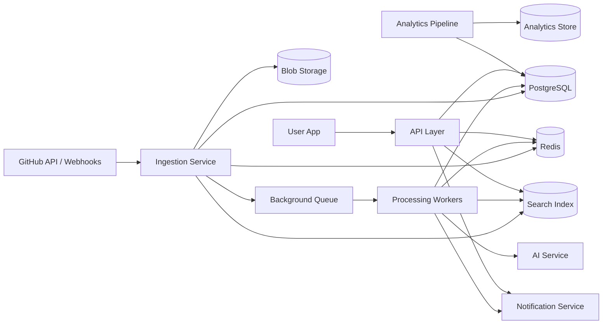
```mermaid
flowchart LR
    GitHub[GitHub API / Webhooks] --> Ingest[Ingestion Service]
    Ingest --> DB[(PostgreSQL)]
    Ingest --> Cache[(Redis)]
    Ingest --> Search[(Search Index)]
    Ingest --> Blob[(Blob Storage)]
    Ingest --> Queue[Background Queue]
    Queue --> Worker[Processing Workers]
    Worker --> AI[AI Service]
    Worker --> DB
    Worker --> Cache
    Worker --> Search
    Worker --> Notifications[Notification Service]
    User[User App] --> API[API Layer]
    API --> DB
    API --> Cache
    API --> Search
    API --> Notifications
    Analytics[Analytics Pipeline] --> DB
    Analytics --> Warehouse[(Analytics Store)]
```

---

## 4. Core Data Domains

### Primary Domains
- repositories
- repository_metadata
- repository_readmes
- users
- saved_repositories
- collections
- contributions
- recommendations
- notifications
- analytics_events
- search_documents

### Supporting Services
- ingestion service
- processing workers
- AI summarization service
- recommendation engine
- indexing service
- notification service
- analytics pipeline

---

## 5. Repository Discovery Flow

### 5.1 Overview
Repository discovery is the process of identifying new or updated repositories that may be relevant to StackLoop users.

### Input
- GitHub repository listing data
- GitHub trending feed or curated sources
- GitHub webhooks for repository changes
- Admin-curated seed repositories
- User-followed organization or topic subscriptions

### Output
- New repository records in the database
- Discovery events for downstream processing
- Candidate repositories marked for metadata extraction

### Processing
1. Pull repository candidates from GitHub APIs or webhook events
2. Normalize repository identity and metadata
3. Deduplicate against existing repositories
4. Insert or update repository records
5. Enqueue downstream processing jobs

### External Systems
- GitHub REST API
- GitHub GraphQL API
- GitHub webhooks
- Optional third-party data providers

### Database Operations
- INSERT/UPSERT into repositories
- CREATE or UPDATE repository discovery audit entries
- Mark status as discovered, queued, or ignored

### Cache Operations
- Cache repository identifiers by source
- Cache discovery result fingerprints
- Store short-lived rate-limit state

### Failure Handling
- Retry on transient API failures
- Use exponential backoff and jitter
- Dead-letter unprocessable repositories after repeated failures
- Log source and reason for each skip or failure

### DFD

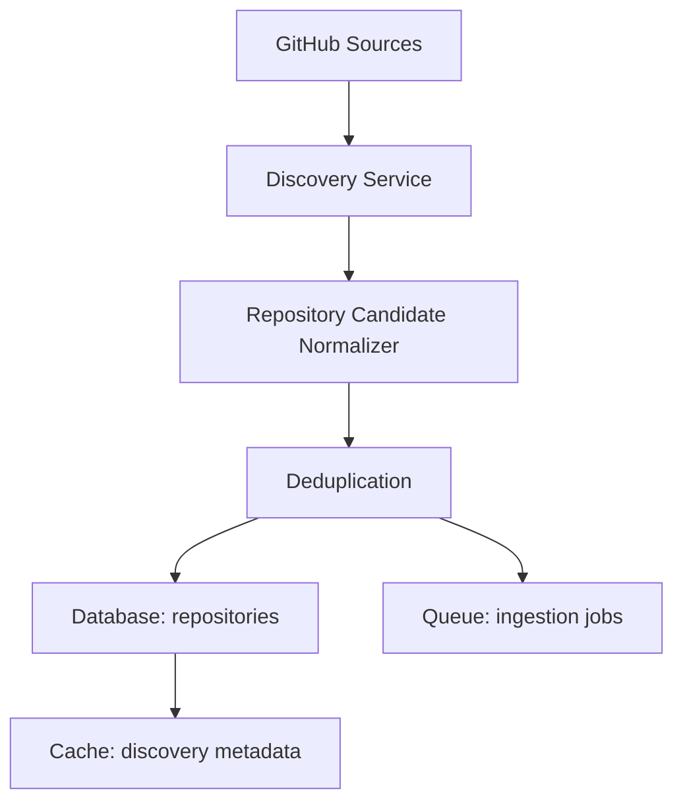
```mermaid
flowchart TD
    A[GitHub Sources] --> B[Discovery Service]
    B --> C[Repository Candidate Normalizer]
    C --> D[Deduplication]
    D --> E[Database: repositories]
    D --> F[Queue: ingestion jobs]
    E --> G[Cache: discovery metadata]
```

### Sequence Diagram

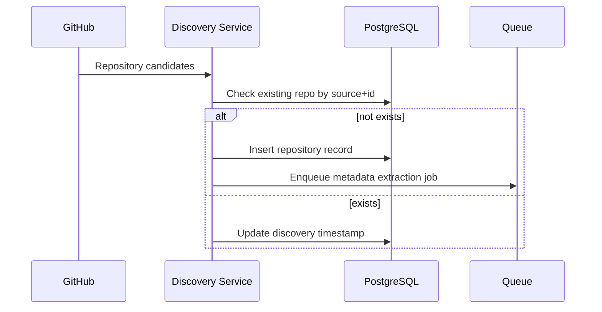
```mermaid
sequenceDiagram
    participant Source as GitHub
    participant DS as Discovery Service
    participant DB as PostgreSQL
    participant Q as Queue

    Source->>DS: Repository candidates
    DS->>DB: Check existing repo by source+id
    alt not exists
        DS->>DB: Insert repository record
        DS->>Q: Enqueue metadata extraction job
    else exists
        DS->>DB: Update discovery timestamp
    end
```

---

## 6. Repository Collection Flow

### 6.1 Overview
Repository collection is the process of gathering the repository’s core metadata and content for indexing and analysis.

### Input
- Repository discovery events
- Repository identifier and owner/name
- GitHub repository metadata payload

### Output
- Repository profile record
- Basic repository metadata fields
- Collection status update

### Processing
1. Fetch repository details from GitHub
2. Normalize fields such as stars, forks, language, topics, issues, and license
3. Store metadata in repository records
4. Trigger README retrieval and enrichment workflow

### External Systems
- GitHub API
- GitHub repository contents endpoint

### Database Operations
- UPDATE repositories table
- INSERT repository_topics or topic links
- INSERT repository_metrics snapshots

### Cache Operations
- Cache repository metadata by repository id
- Cache topic lookup results
- Store short-lived API response snapshots

### Failure Handling
- Retry repository fetches on transient errors
- Fall back to last known good metadata if a fresh fetch fails
- Record data freshness and last successful sync timestamp

### DFD

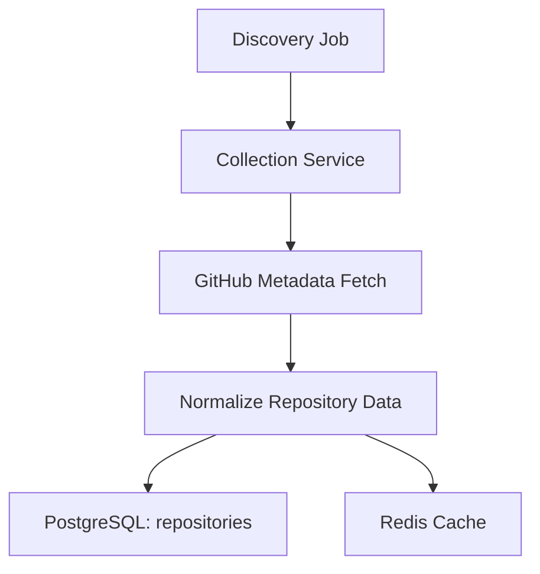
```mermaid
flowchart TD
    A[Discovery Job] --> B[Collection Service]
    B --> C[GitHub Metadata Fetch]
    C --> D[Normalize Repository Data]
    D --> E[PostgreSQL: repositories]
    D --> F[Redis Cache]
```

---

## 7. Metadata Extraction Flow

### 7.1 Overview
Metadata extraction turns raw repository attributes into structured information for downstream search, recommendations, and user-facing insights.

### Input
- Repository record
- Raw GitHub repository payload
- Repository topics, language, contributor count, activity metrics

### Output
- Structured metadata entities
- Language and technology tags
- Repository quality signals
- Enrichment flags and categories

### Processing
1. Parse repository info and infer taxonomy
2. Extract language, topics, license, and contribution signals
3. Generate category and technology embeddings or tags
4. Write normalized results into relational tables and search documents

### External Systems
- GitHub repository metadata
- Optional language classification providers

### Database Operations
- INSERT/UPDATE repository_technologies
- INSERT/UPDATE repository_categories
- INSERT/UPDATE repository_metrics

### Cache Operations
- Cache extracted tags and categories
- Use precomputed summaries for repeated reads

### Failure Handling
- If extraction fails, keep the repository in a pending state
- Retry from the raw payload if available
- Avoid stopping the full ingestion pipeline because one extraction step failed

### DFD

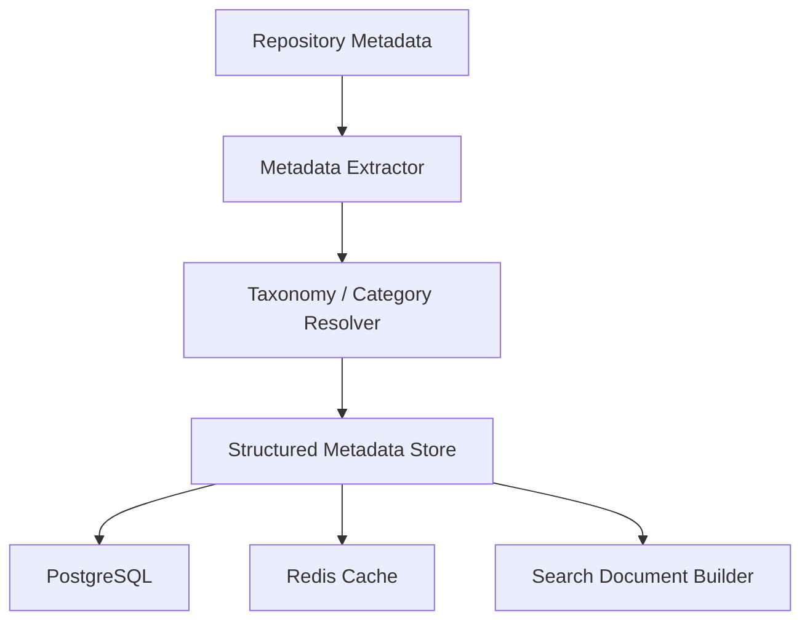
```mermaid
flowchart TD
    A[Repository Metadata] --> B[Metadata Extractor]
    B --> C[Taxonomy / Category Resolver]
    C --> D[Structured Metadata Store]
    D --> E[PostgreSQL]
    D --> F[Redis Cache]
    D --> G[Search Document Builder]
```

---

## 8. README Processing Flow

### 8.1 Overview
README processing transforms repository documentation into text, structure, and semantic features for AI summarization and search.

### Input
- Repository ID
- README content from GitHub or repository contents API
- Repository language and metadata

### Output
- Cleaned README text
- Structured content chunks
- Basic readability and topic features
- Input artifact for AI processing

### Processing
1. Fetch README content
2. Strip boilerplate and normalize markdown
3. Chunk content into sections for analysis
4. Store raw and processed text versions
5. Enqueue AI summarization job

### External Systems
- GitHub repository contents API
- Optional markdown parsing libraries

### Database Operations
- INSERT/UPDATE repository_readmes
- INSERT/UPDATE readme_chunks or processed_content stores

### Cache Operations
- Cache processed README text by repository ID
- Cache chunked representations for repeated AI jobs

### Failure Handling
- If README is missing, mark as no-readme and continue
- If content is too large, truncate and chunk safely
- Retry fetching if the readme endpoint is temporarily unavailable

### DFD

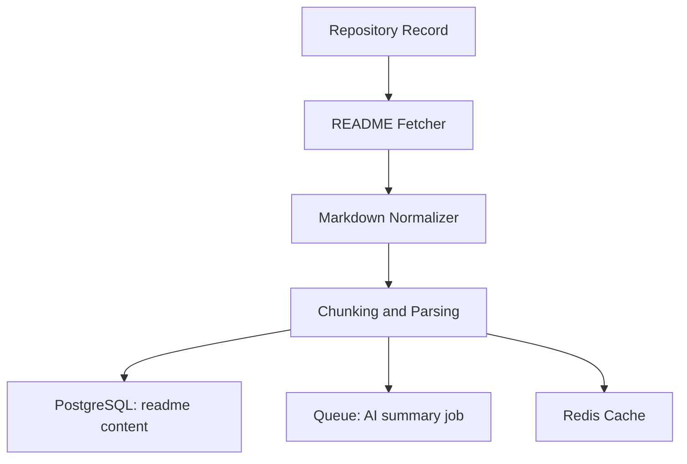
```mermaid
flowchart TD
    A[Repository Record] --> B[README Fetcher]
    B --> C[Markdown Normalizer]
    C --> D[Chunking and Parsing]
    D --> E[PostgreSQL: readme content]
    D --> F[Queue: AI summary job]
    D --> G[Redis Cache]
```

---

## 9. AI Summary Generation Flow

### 9.1 Overview
AI summary generation turns repository metadata and README content into human-readable insights, learning guidance, and contribution suggestions.

### Input
- Cleaned README content
- Repository metadata
- Language and topic tags
- Repository health signals

### Output
- AI-generated summary
- Repository insights
- Suggested learning path or contribution hints
- Confidence score and model metadata

### Processing
1. Build a prompt from repository metadata and README content
2. Call the AI service with safety and rate controls
3. Parse and normalize the output
4. Store the summary and derived insights
5. Trigger downstream recommendation updates

### External Systems
- AI model provider
- Prompt orchestration service
- Optional embeddings service

### Database Operations
- INSERT/UPDATE ai_summaries
- INSERT/UPDATE repository_insights
- UPDATE repository summary freshness timestamps

### Cache Operations
- Cache generated summaries by repository id
- Cache prompt or model response states for retries
- Store recent generation results for reuse

### Failure Handling
- Retry transient model failures
- Store partial outputs if a response is incomplete
- Mark summaries as pending or failed instead of blocking ingestion
- Use fallback templates when AI output is unavailable

### DFD

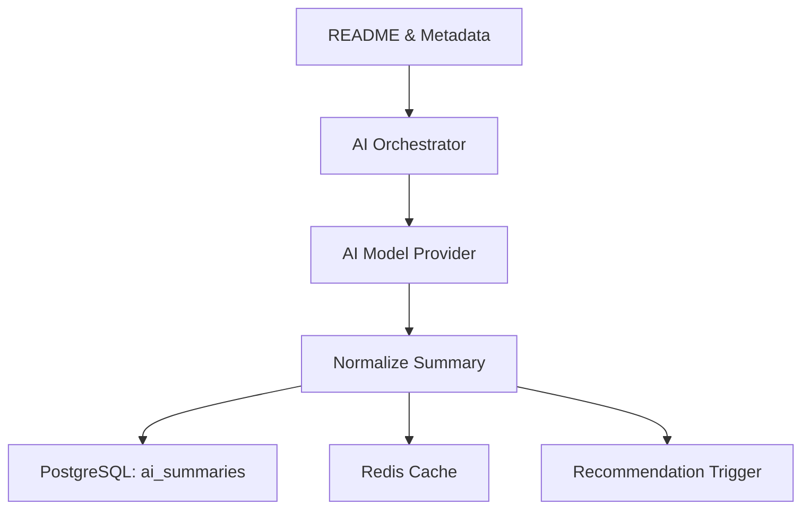
```mermaid
flowchart TD
    A[README & Metadata] --> B[AI Orchestrator]
    B --> C[AI Model Provider]
    C --> D[Normalize Summary]
    D --> E[PostgreSQL: ai_summaries]
    D --> F[Redis Cache]
    D --> G[Recommendation Trigger]
```

### Sequence Diagram

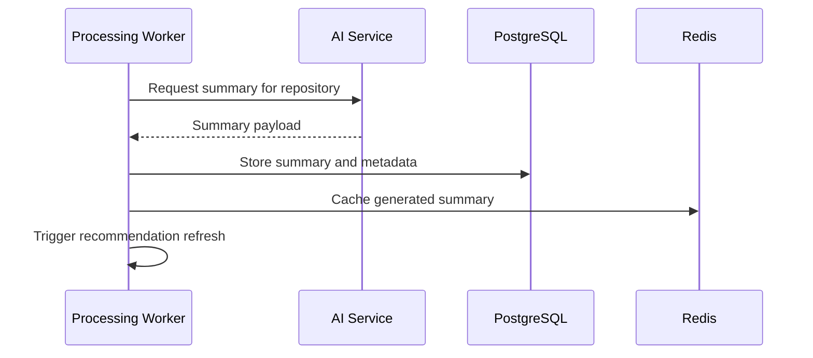
```mermaid
sequenceDiagram
    participant Worker as Processing Worker
    participant AI as AI Service
    participant DB as PostgreSQL
    participant Cache as Redis

    Worker->>AI: Request summary for repository
    AI-->>Worker: Summary payload
    Worker->>DB: Store summary and metadata
    Worker->>Cache: Cache generated summary
    Worker->>Worker: Trigger recommendation refresh
```

---

## 10. Recommendation Engine Flow

### 10.1 Overview
The recommendation engine ranks repositories and learning opportunities for each user based on interest, behavior, and repository signals.

### Input
- User profile and interests
- User activity history
- Repository metadata and AI insights
- Similarity signals between users or repositories

### Output
- Personalized repository recommendations
- Recommendation lists with score explanations
- Updated user feed or homepage cards

### Processing
1. Build a feature vector from user behavior and repository metadata
2. Compute similarity scores or ranking signals
3. Filter out already saved or irrelevant items
4. Store ranked recommendations for display

### External Systems
- Optional embeddings or vector search service
- Internal scoring service

### Database Operations
- INSERT/UPDATE user_recommendations
- STORE ranking explanation metadata
- UPDATE recommendation generation timestamps

### Cache Operations
- Cache recommendation lists per user
- Cache ranking features for rapid recomputation
- Store short-lived invalidation markers

### Failure Handling
- If ranking fails, fall back to popular or recently updated repositories
- Use stale recommendations if freshness is unavailable
- Retry offline batch recomputation for large user segments

### DFD

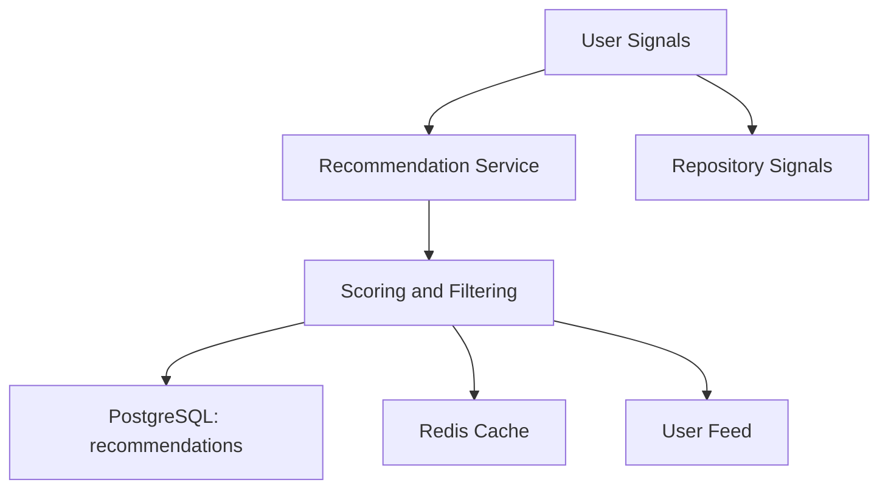
```mermaid
flowchart TD
    A[User Signals] --> B[Recommendation Service]
    A --> C[Repository Signals]
    B --> D[Scoring and Filtering]
    D --> E[PostgreSQL: recommendations]
    D --> F[Redis Cache]
    D --> G[User Feed]
```

---

## 11. Search Indexing Flow

### 11.1 Overview
Search indexing makes repositories discoverable through semantic and keyword search.

### Input
- Structured repository metadata
- README text chunks
- AI summaries and tags
- User-generated content and collections

### Output
- Search documents indexed for retrieval
- Searchable repository and content results

### Processing
1. Normalize repository content into search documents
2. Generate searchable fields such as title, description, topics, languages, summary, and README chunks
3. Update the search index asynchronously
4. Handle partial failures and reindexing safely

### External Systems
- Search engine such as OpenSearch, Elasticsearch, or Azure AI Search
- Optional vector embedding provider

### Database Operations
- Read repository metadata from PostgreSQL
- Update search_document version or status

### Cache Operations
- Cache recent search index updates
- Cache search result sets for popular queries

### Failure Handling
- Retry indexing for failed documents
- Queue reindex operations after upstream data changes
- Use versioning to prevent stale index entries

### DFD

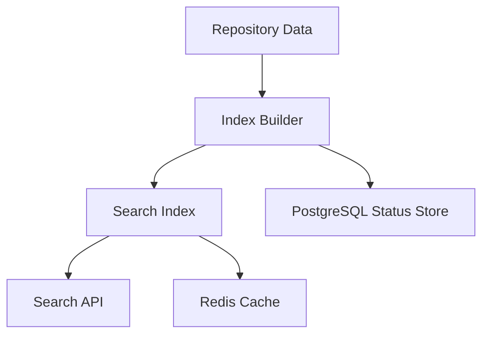
```mermaid
flowchart TD
    A[Repository Data] --> B[Index Builder]
    B --> C[Search Index]
    C --> D[Search API]
    B --> E[PostgreSQL Status Store]
    C --> F[Redis Cache]
```

---

## 12. User Personalization Flow

### 12.1 Overview
User personalization enables the platform to tailor repository discovery, recommendations, and feed behavior.

### Input
- User profile
- Saved repositories
- Search history
- Clicks and engagement events
- Followed topics or languages

### Output
- Personalized user profile embedding
- Updated recommendation signals
- Tailored homepage and discovery feed

### Processing
1. Aggregate behavior and preference signals
2. Update user interest profiles and embeddings
3. Recompute personalized recommendation candidates
4. Store derived profile snapshots

### External Systems
- Event analytics pipeline
- Recommendation engine

### Database Operations
- UPDATE users profile tables
- INSERT user_preferences or user_interest_signals
- UPDATE personalization snapshots

### Cache Operations
- Cache user preference profiles
- Cache personalized recommendation lists

### Failure Handling
- If personalization data is unavailable, use default or generic recommendations
- Process event updates asynchronously to preserve performance
- Retry missing or partial events

### DFD

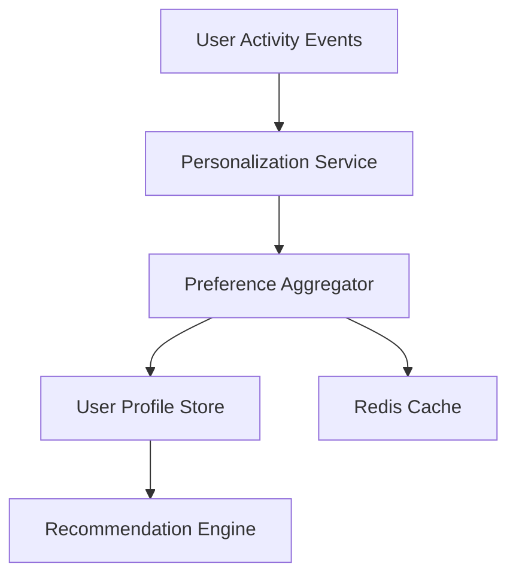
```mermaid
flowchart TD
    A[User Activity Events] --> B[Personalization Service]
    B --> C[Preference Aggregator]
    C --> D[User Profile Store]
    D --> E[Recommendation Engine]
    C --> F[Redis Cache]
```

---

## 13. Repository Saving Flow

### 13.1 Overview
Repository saving allows a user to bookmark repositories for later review.

### Input
- User ID
- Repository ID
- Optional collection assignment
- Optional note or tag

### Output
- Saved repository relationship
- Updated user dashboard state
- Notification or activity event

### Processing
1. Validate the repository and authentication context
2. Create or update the save relationship
3. Update the user’s saved set and related counters
4. Trigger notification or feed update if needed

### External Systems
- API layer
- Notification service

### Database Operations
- INSERT/UPDATE saved_repositories
- UPDATE user saved count and activity metrics

### Cache Operations
- Invalidate user saved-repository cache
- Update recent-saved cache entries

### Failure Handling
- Handle duplicate saves idempotently
- Roll back partial writes if a downstream notification fails
- Return a clear conflict or success response

### DFD

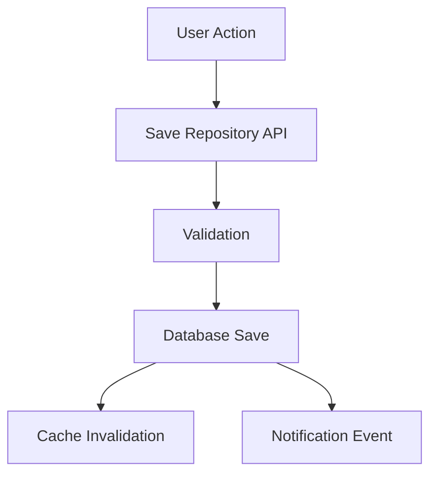
```mermaid
flowchart TD
    A[User Action] --> B[Save Repository API]
    B --> C[Validation]
    C --> D[Database Save]
    D --> E[Cache Invalidation]
    D --> F[Notification Event]
```

---

## 14. Contribution Tracking Flow

### 14.1 Overview
Contribution tracking records a user’s efforts toward open-source projects, including actions, PRs, issues, and contributions.

### Input
- User activity
- GitHub contribution events
- Manual contribution submissions
- Repository contribution metadata

### Output
- Contribution records
- Contribution history and status
- Contribution opportunities for discovery

### Processing
1. Receive or poll contribution events
2. Normalize contribution metadata
3. Associate contribution with repositories and users
4. Update contribution analytics and recommendations

### External Systems
- GitHub API
- GitHub webhooks
- Optional contribution provider integrations

### Database Operations
- INSERT/UPDATE contributions
- UPDATE repository contribution metrics
- INSERT contribution_activity_events

### Cache Operations
- Cache contribution summaries by user or repository
- Invalidate stale contribution feed entries

### Failure Handling
- Retry external fetches for missing contribution data
- Handle duplicates gracefully
- Mark records as pending when source data is incomplete

### DFD

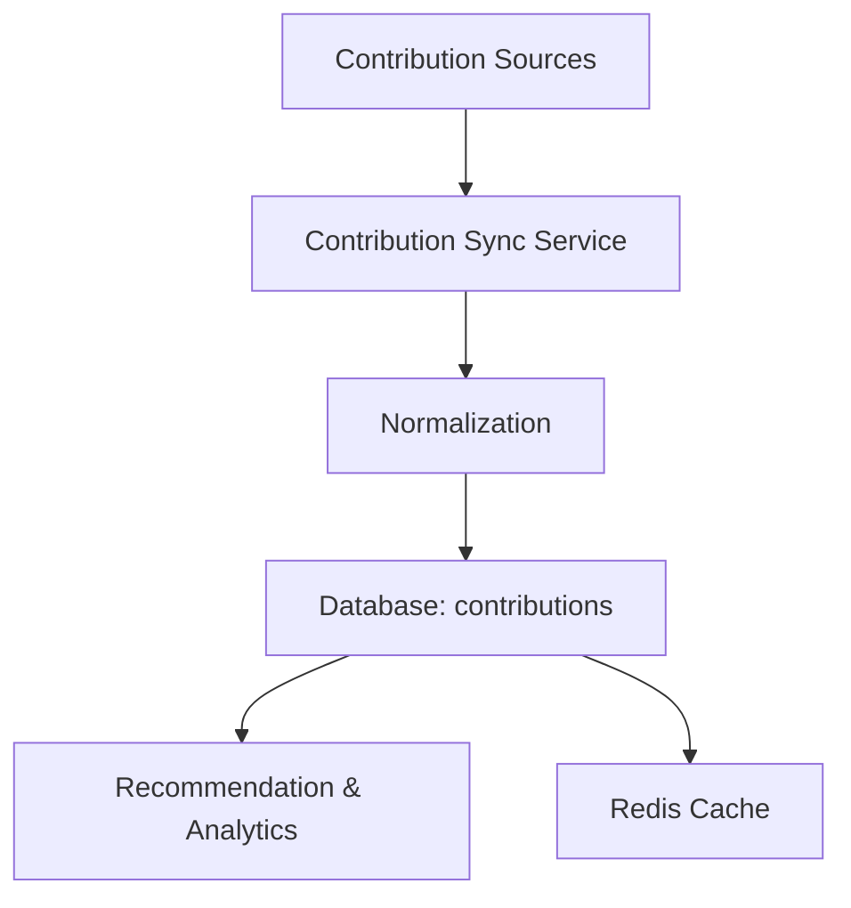
```mermaid
flowchart TD
    A[Contribution Sources] --> B[Contribution Sync Service]
    B --> C[Normalization]
    C --> D[Database: contributions]
    D --> E[Recommendation & Analytics]
    D --> F[Redis Cache]
```

---

## 15. Notification System Flow

### 15.1 Overview
The notification system informs users about repository updates, recommendations, saved content changes, contributions, and platform events.

### Input
- Repository updates
- Recommendation changes
- Contribution activity
- User actions
- Platform system events

### Output
- User notifications
- In-app notification feed entries
- Optional email or webhook delivery

### Processing
1. Detect relevant events
2. Determine recipients and channel preferences
3. Create notification records
4. Dispatch through in-app, email, or push channels

### External Systems
- Email provider
- Push notification provider
- Webhook-based integrations

### Database Operations
- INSERT notifications
- UPDATE notification status
- INSERT delivery attempts

### Cache Operations
- Cache recent unread notifications per user
- Cache notification channel preferences

### Failure Handling
- Retry delivery on transient failures
- Use dead-letter queue for permanent delivery issues
- Mark notifications as failed but preserve audit trail

### DFD

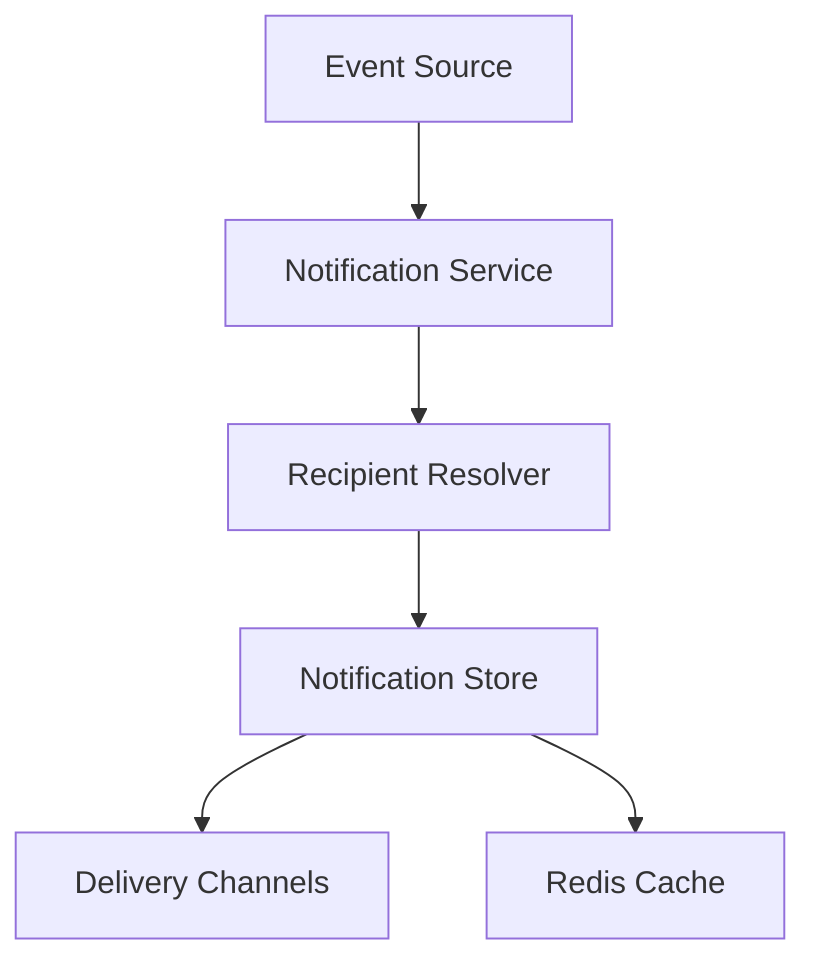
```mermaid
flowchart TD
    A[Event Source] --> B[Notification Service]
    B --> C[Recipient Resolver]
    C --> D[Notification Store]
    D --> E[Delivery Channels]
    D --> F[Redis Cache]
```

---

## 16. Analytics Flow

### 16.1 Overview
Analytics captures usage, performance, and behavioral events for product decisions, monitoring, and growth analysis.

### Input
- User actions
- Page views
- Search events
- Recommendation clicks
- API errors and performance events

### Output
- Analytics events
- Product metrics
- Operational dashboards and trend analysis

### Processing
1. Capture events from clients and services
2. Normalize and enrich event payloads
3. Store raw events and computed aggregates
4. Feed dashboards and reporting systems

### External Systems
- Analytics event collection service
- Metrics dashboards
- Optional data warehouse

### Database Operations
- INSERT analytics_events
- UPDATE aggregate metrics tables
- INSERT reporting snapshots

### Cache Operations
- Cache recent dashboard aggregates
- Buffer burst traffic into asynchronous writes

### Failure Handling
- Buffer and retry event ingestion on failure
- Drop invalid events without breaking core user flows
- Preserve event counts with best-effort delivery

### DFD

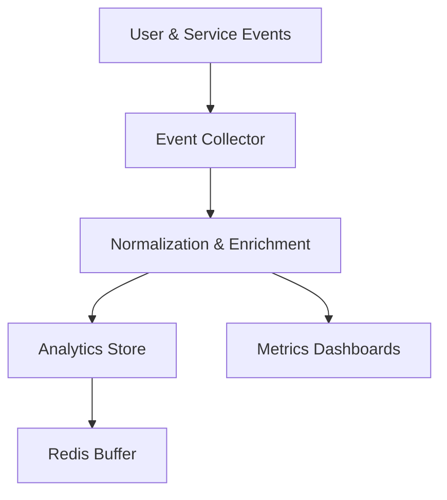
```mermaid
flowchart TD
    A[User & Service Events] --> B[Event Collector]
    B --> C[Normalization & Enrichment]
    C --> D[Analytics Store]
    C --> E[Metrics Dashboards]
    D --> F[Redis Buffer]
```

---

## 17. Cross-Cutting Reliability Design

### 17.1 Asynchronous Processing
Heavy tasks such as AI summarization, search indexing, and notifications should run asynchronously through queues.

Recommended queue architecture:
- ingestion-queue
- processing-queue
- ai-queue
- notification-queue
- analytics-queue

### 17.2 Idempotency
Every downstream processing step should be idempotent so retries do not create duplicate state.

Recommended patterns:
- natural key uniqueness on repository and event records
- processing version markers
- deduplication tokens in queue messages

### 17.3 Retries and Backoff
- Retries should use exponential backoff with jitter
- Dead-letter queues should capture repeated failures
- Retry budgets should be configurable per pipeline

### 17.4 Observability
Each pipeline should expose:
- logs
- tracing IDs
- metrics on queue depth, processing time, failure rate, and latency

### 17.5 Fault Isolation
- Search indexing failures should not block repository ingestion
- AI summarization failures should not block repository visibility
- Notification failures should not block core user actions

---

## 18. Data Flow Summary by Process

| Process | Input | Output | Processing | External Systems | DB Operations | Cache Operations | Failure Handling |
| --- | --- | --- | --- | --- | --- | --- | --- |
| GitHub Repository Discovery | GitHub source data | repository records | normalize, dedupe, enqueue | GitHub APIs | INSERT/UPSERT repositories | cache discovery state | retry, backoff, DLQ |
| Repository Collection | repo candidate | metadata record | fetch details, normalize | GitHub API | UPDATE repositories | cache metadata | fallback to last known data |
| Metadata Extraction | repo metadata | enriched metadata | classify, extract tags | GitHub + optional providers | INSERT/UPDATE tags/metrics | cache extracted metadata | retry pending state |
| README Processing | repository content | cleaned/readme chunks | normalize markdown, chunk | GitHub contents API | store readme content | cache chunks | skip missing README |
| AI Summary Generation | readme + metadata | insights summary | prompt/model call | AI provider | store summaries | cache summaries | fallback template |
| Recommendation Engine | user/repo signals | ranked recommendations | score, filter, rank | internal scoring engine | store recommendation results | cache user feeds | fallback to popular repos |
| Search Indexing | repository and content data | indexed documents | transform, index, update | search engine | read/mark index status | cache search queries | retry and reindex |
| User Personalization | user activity | profile signals | aggregate behavior | analytics pipeline | update profile signals | cache preferences | fallback default profile |
| Repository Saving | user + repo action | saved relationship | validate, store, invalidate | API + notification | save relationship | invalidate saved cache | idempotent duplicate handling |
| Contribution Tracking | contribution events | contribution records | normalize, associate | GitHub API | insert/update contributions | cache summaries | retry and pending state |
| Notification System | platform events | notification records | route and deliver | email/push/webhooks | insert/update notifications | cache unread list | retry and DLQ |
| Analytics | user/service events | analytics metrics | collect, normalize, aggregate | analytics backend | insert events | buffer aggregates | best-effort ingestion |

---

## 19. Recommended Storage and Processing Layers

### Transactional Layer
- PostgreSQL is the system of record
- Use relational integrity for user, repository, contribution, and notification data

### Cache Layer
- Redis holds short-lived data, hot reads, throttling state, and queue coordination

### Search Layer
- Search engine indexes repository documents and content for fast retrieval

### Blob Layer
- Blob Storage stores large or binary artifacts such as screenshots or exported content

### Processing Layer
- Worker services execute enrichment, AI, indexing, and notification tasks asynchronously

---

## 20. Production Recommendations

- Use queue-based workflows for all expensive tasks
- Emphasize idempotent event processing
- Separate read and write paths where possible
- Partition or shard large analytics data over time if volume grows
- Keep event schemas versioned
- Create replay and repair workflows for data reprocessing
- Collect metrics for queue lag, processing latency, and ingestion failures

---

## 21. Final Recommendation

StackLoop should be implemented as a modular, event-driven data platform with PostgreSQL as the system of record, Redis for cache and transient coordination, a search engine for retrieval, asynchronous workers for enrichment and intelligence, and explicit retry and dead-letter patterns for resilience. This approach supports growth, fault tolerance, and clear separation between discovery, enrichment, personalization, and user-facing experiences.
