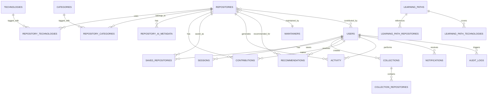

# StackLoop PostgreSQL Database Schema Specification

## 1. Design Goals

The StackLoop database is designed for a high-scale developer platform that must support:
- transactional correctness for users, repositories, and contributions
- read-heavy discovery workflows such as feed browsing and search
- normalized storage for entities and relationships
- fast retrieval for repository and recommendation surfaces
- auditability, security, and future extensibility

### Design Principles
- Normalize core domain entities while preserving read performance through targeted denormalization where justified
- Use strong constraints and immutable identifiers for integrity
- Separate operational and analytics data where appropriate
- Optimize for common access patterns such as repository lookup, recommendation fetch, activity feed generation, and search enrichment

---

## 2. ER Diagram



---

## 3. Core Conventions

### Naming Conventions
- Use lowercase snake_case for table and column names
- Use singular nouns for entity tables where appropriate
- Use pluralized names for relationship or junction tables when they represent collections of associations
- Prefer explicit names such as repository_ai_metadata instead of ai_data

### Identifier Strategy
- Use UUID primary keys for most user-facing and distributed entities
- Use BIGSERIAL or BIGINT for large internal counters when appropriate
- Use created_at and updated_at columns for change tracking

### Timestamp Strategy
- Every mutable entity should have created_at and updated_at
- Soft deletion should be supported with deleted_at where relevant

---

## 4. Table Definitions

## 4.1 users

Purpose: Stores authenticated user identity and profile information.

```sql
CREATE TABLE users (
    id UUID PRIMARY KEY DEFAULT gen_random_uuid(),
    github_id BIGINT UNIQUE NOT NULL,
    username VARCHAR(255) NOT NULL,
    display_name VARCHAR(255),
    email VARCHAR(320),
    avatar_url TEXT,
    bio TEXT,
    location VARCHAR(255),
    website_url TEXT,
    company VARCHAR(255),
    role VARCHAR(50) DEFAULT 'user',
    is_active BOOLEAN NOT NULL DEFAULT true,
    is_verified BOOLEAN NOT NULL DEFAULT false,
    github_connected_at TIMESTAMPTZ,
    last_login_at TIMESTAMPTZ,
    created_at TIMESTAMPTZ NOT NULL DEFAULT now(),
    updated_at TIMESTAMPTZ NOT NULL DEFAULT now(),
    deleted_at TIMESTAMPTZ
);
```

### Notes
- github_id provides a stable external identity reference
- role supports future distinctions such as admin, maintainer, moderator

### Suggested Indexes
```sql
CREATE INDEX idx_users_username ON users (username);
CREATE INDEX idx_users_github_id ON users (github_id);
CREATE INDEX idx_users_created_at ON users (created_at DESC);
CREATE INDEX idx_users_is_active ON users (is_active);
```

---

## 4.2 sessions

Purpose: Stores active authentication sessions.

```sql
CREATE TABLE sessions (
    id UUID PRIMARY KEY DEFAULT gen_random_uuid(),
    user_id UUID NOT NULL REFERENCES users(id) ON DELETE CASCADE,
    provider VARCHAR(50) NOT NULL DEFAULT 'github',
    access_token_encrypted TEXT,
    refresh_token_encrypted TEXT,
    expires_at TIMESTAMPTZ NOT NULL,
    revoked_at TIMESTAMPTZ,
    created_at TIMESTAMPTZ NOT NULL DEFAULT now(),
    updated_at TIMESTAMPTZ NOT NULL DEFAULT now()
);
```

### Suggested Indexes
```sql
CREATE INDEX idx_sessions_user_id ON sessions (user_id);
CREATE INDEX idx_sessions_expires_at ON sessions (expires_at);
CREATE INDEX idx_sessions_revoked_at ON sessions (revoked_at);
```

---

## 4.3 maintainers

Purpose: Stores repository maintainers and ownership references.

```sql
CREATE TABLE maintainers (
    id UUID PRIMARY KEY DEFAULT gen_random_uuid(),
    user_id UUID REFERENCES users(id) ON DELETE SET NULL,
    github_login VARCHAR(255) NOT NULL,
    display_name VARCHAR(255),
    avatar_url TEXT,
    company VARCHAR(255),
    website_url TEXT,
    is_verified BOOLEAN NOT NULL DEFAULT false,
    created_at TIMESTAMPTZ NOT NULL DEFAULT now(),
    updated_at TIMESTAMPTZ NOT NULL DEFAULT now()
);
```

### Suggested Indexes
```sql
CREATE INDEX idx_maintainers_user_id ON maintainers (user_id);
CREATE INDEX idx_maintainers_github_login ON maintainers (github_login);
```

---

## 4.4 repositories

Purpose: Stores the canonical repository record for open-source projects.

```sql
CREATE TABLE repositories (
    id UUID PRIMARY KEY DEFAULT gen_random_uuid(),
    github_id BIGINT UNIQUE NOT NULL,
    owner_login VARCHAR(255) NOT NULL,
    name VARCHAR(255) NOT NULL,
    full_name VARCHAR(512) NOT NULL,
    description TEXT,
    homepage_url TEXT,
    repository_url TEXT NOT NULL,
    default_branch VARCHAR(255) DEFAULT 'main',
    language VARCHAR(255),
    stargazers_count INTEGER NOT NULL DEFAULT 0,
    forks_count INTEGER NOT NULL DEFAULT 0,
    open_issues_count INTEGER NOT NULL DEFAULT 0,
    watchers_count INTEGER NOT NULL DEFAULT 0,
    size_kb INTEGER,
    is_archived BOOLEAN NOT NULL DEFAULT false,
    is_disabled BOOLEAN NOT NULL DEFAULT false,
    is_private BOOLEAN NOT NULL DEFAULT false,
    is_verified BOOLEAN NOT NULL DEFAULT false,
    last_push_at TIMESTAMPTZ,
    last_synced_at TIMESTAMPTZ,
    created_at TIMESTAMPTZ NOT NULL DEFAULT now(),
    updated_at TIMESTAMPTZ NOT NULL DEFAULT now(),
    deleted_at TIMESTAMPTZ
);
```

### Suggested Indexes
```sql
CREATE INDEX idx_repositories_full_name ON repositories (full_name);
CREATE INDEX idx_repositories_owner_login ON repositories (owner_login);
CREATE INDEX idx_repositories_stargazers_count ON repositories (stargazers_count DESC);
CREATE INDEX idx_repositories_last_push_at ON repositories (last_push_at DESC);
CREATE INDEX idx_repositories_is_archived ON repositories (is_archived);
CREATE INDEX idx_repositories_is_private ON repositories (is_private);
CREATE INDEX idx_repositories_created_at ON repositories (created_at DESC);
```

### Relationship Notes
- repositories is the central entity in the platform
- It is linked to maintainers, categories, technologies, AI metadata, contributions, and user interactions

---

## 4.5 repository_maintainers

Purpose: Junction table linking repositories to maintainers.

```sql
CREATE TABLE repository_maintainers (
    repository_id UUID NOT NULL REFERENCES repositories(id) ON DELETE CASCADE,
    maintainer_id UUID NOT NULL REFERENCES maintainers(id) ON DELETE CASCADE,
    role VARCHAR(50) DEFAULT 'maintainer',
    created_at TIMESTAMPTZ NOT NULL DEFAULT now(),
    PRIMARY KEY (repository_id, maintainer_id)
);
```

### Suggested Indexes
```sql
CREATE INDEX idx_repository_maintainers_maintainer_id ON repository_maintainers (maintainer_id);
```

---

## 4.6 technologies

Purpose: Stores canonical technologies, languages, frameworks, and ecosystems.

```sql
CREATE TABLE technologies (
    id UUID PRIMARY KEY DEFAULT gen_random_uuid(),
    slug VARCHAR(255) UNIQUE NOT NULL,
    name VARCHAR(255) NOT NULL,
    description TEXT,
    category VARCHAR(255),
    parent_id UUID REFERENCES technologies(id) ON DELETE SET NULL,
    is_active BOOLEAN NOT NULL DEFAULT true,
    created_at TIMESTAMPTZ NOT NULL DEFAULT now(),
    updated_at TIMESTAMPTZ NOT NULL DEFAULT now()
);
```

### Suggested Indexes
```sql
CREATE INDEX idx_technologies_slug ON technologies (slug);
CREATE INDEX idx_technologies_name ON technologies (name);
CREATE INDEX idx_technologies_parent_id ON technologies (parent_id);
```

---

## 4.7 categories

Purpose: Stores high-level discovery categories such as AI, DevTools, Backend, and Data.

```sql
CREATE TABLE categories (
    id UUID PRIMARY KEY DEFAULT gen_random_uuid(),
    slug VARCHAR(255) UNIQUE NOT NULL,
    name VARCHAR(255) NOT NULL,
    description TEXT,
    parent_id UUID REFERENCES categories(id) ON DELETE SET NULL,
    is_active BOOLEAN NOT NULL DEFAULT true,
    created_at TIMESTAMPTZ NOT NULL DEFAULT now(),
    updated_at TIMESTAMPTZ NOT NULL DEFAULT now()
);
```

### Suggested Indexes
```sql
CREATE INDEX idx_categories_slug ON categories (slug);
CREATE INDEX idx_categories_name ON categories (name);
```

---

## 4.8 repository_technologies

Purpose: Junction table linking repositories to technologies.

```sql
CREATE TABLE repository_technologies (
    repository_id UUID NOT NULL REFERENCES repositories(id) ON DELETE CASCADE,
    technology_id UUID NOT NULL REFERENCES technologies(id) ON DELETE CASCADE,
    confidence_score NUMERIC(5,4) DEFAULT 1.0,
    created_at TIMESTAMPTZ NOT NULL DEFAULT now(),
    PRIMARY KEY (repository_id, technology_id)
);
```

### Suggested Indexes
```sql
CREATE INDEX idx_repository_technologies_technology_id ON repository_technologies (technology_id);
CREATE INDEX idx_repository_technologies_confidence_score ON repository_technologies (confidence_score DESC);
```

---

## 4.9 repository_categories

Purpose: Junction table linking repositories to categories.

```sql
CREATE TABLE repository_categories (
    repository_id UUID NOT NULL REFERENCES repositories(id) ON DELETE CASCADE,
    category_id UUID NOT NULL REFERENCES categories(id) ON DELETE CASCADE,
    created_at TIMESTAMPTZ NOT NULL DEFAULT now(),
    PRIMARY KEY (repository_id, category_id)
);
```

### Suggested Indexes
```sql
CREATE INDEX idx_repository_categories_category_id ON repository_categories (category_id);
```

---

## 4.10 learning_paths

Purpose: Stores structured educational content for learning a technology or stack.

```sql
CREATE TABLE learning_paths (
    id UUID PRIMARY KEY DEFAULT gen_random_uuid(),
    slug VARCHAR(255) UNIQUE NOT NULL,
    title VARCHAR(255) NOT NULL,
    description TEXT,
    difficulty VARCHAR(50),
    estimated_duration_days INTEGER,
    is_featured BOOLEAN NOT NULL DEFAULT false,
    created_by UUID REFERENCES users(id) ON DELETE SET NULL,
    created_at TIMESTAMPTZ NOT NULL DEFAULT now(),
    updated_at TIMESTAMPTZ NOT NULL DEFAULT now()
);
```

### Suggested Indexes
```sql
CREATE INDEX idx_learning_paths_slug ON learning_paths (slug);
CREATE INDEX idx_learning_paths_is_featured ON learning_paths (is_featured);
CREATE INDEX idx_learning_paths_created_at ON learning_paths (created_at DESC);
```

---

## 4.11 learning_path_repositories

Purpose: Links learning paths to repositories.

```sql
CREATE TABLE learning_path_repositories (
    learning_path_id UUID NOT NULL REFERENCES learning_paths(id) ON DELETE CASCADE,
    repository_id UUID NOT NULL REFERENCES repositories(id) ON DELETE CASCADE,
    sequence_order INTEGER NOT NULL DEFAULT 1,
    created_at TIMESTAMPTZ NOT NULL DEFAULT now(),
    PRIMARY KEY (learning_path_id, repository_id)
);
```

### Suggested Indexes
```sql
CREATE INDEX idx_learning_path_repositories_repository_id ON learning_path_repositories (repository_id);
CREATE INDEX idx_learning_path_repositories_order ON learning_path_repositories (learning_path_id, sequence_order);
```

---

## 4.12 learning_path_technologies

Purpose: Links learning paths to technologies.

```sql
CREATE TABLE learning_path_technologies (
    learning_path_id UUID NOT NULL REFERENCES learning_paths(id) ON DELETE CASCADE,
    technology_id UUID NOT NULL REFERENCES technologies(id) ON DELETE CASCADE,
    created_at TIMESTAMPTZ NOT NULL DEFAULT now(),
    PRIMARY KEY (learning_path_id, technology_id)
);
```

---

## 4.13 collections

Purpose: Stores user-created or curated collections of repositories.

```sql
CREATE TABLE collections (
    id UUID PRIMARY KEY DEFAULT gen_random_uuid(),
    user_id UUID NOT NULL REFERENCES users(id) ON DELETE CASCADE,
    name VARCHAR(255) NOT NULL,
    description TEXT,
    is_public BOOLEAN NOT NULL DEFAULT false,
    is_featured BOOLEAN NOT NULL DEFAULT false,
    created_at TIMESTAMPTZ NOT NULL DEFAULT now(),
    updated_at TIMESTAMPTZ NOT NULL DEFAULT now()
);
```

### Suggested Indexes
```sql
CREATE INDEX idx_collections_user_id ON collections (user_id);
CREATE INDEX idx_collections_is_public ON collections (is_public);
CREATE INDEX idx_collections_is_featured ON collections (is_featured);
```

---

## 4.14 collection_repositories

Purpose: Junction table linking collections to repositories.

```sql
CREATE TABLE collection_repositories (
    collection_id UUID NOT NULL REFERENCES collections(id) ON DELETE CASCADE,
    repository_id UUID NOT NULL REFERENCES repositories(id) ON DELETE CASCADE,
    added_at TIMESTAMPTZ NOT NULL DEFAULT now(),
    PRIMARY KEY (collection_id, repository_id)
);
```

### Suggested Indexes
```sql
CREATE INDEX idx_collection_repositories_repository_id ON collection_repositories (repository_id);
```

---

## 4.15 saved_repositories

Purpose: Stores repositories saved by users for later review.

```sql
CREATE TABLE saved_repositories (
    id UUID PRIMARY KEY DEFAULT gen_random_uuid(),
    user_id UUID NOT NULL REFERENCES users(id) ON DELETE CASCADE,
    repository_id UUID NOT NULL REFERENCES repositories(id) ON DELETE CASCADE,
    collection_id UUID REFERENCES collections(id) ON DELETE SET NULL,
    saved_at TIMESTAMPTZ NOT NULL DEFAULT now(),
    UNIQUE (user_id, repository_id)
);
```

### Suggested Indexes
```sql
CREATE INDEX idx_saved_repositories_user_id ON saved_repositories (user_id);
CREATE INDEX idx_saved_repositories_repository_id ON saved_repositories (repository_id);
CREATE INDEX idx_saved_repositories_saved_at ON saved_repositories (saved_at DESC);
```

---

## 4.16 recommendations

Purpose: Stores personalized recommendations for users.

```sql
CREATE TABLE recommendations (
    id UUID PRIMARY KEY DEFAULT gen_random_uuid(),
    user_id UUID NOT NULL REFERENCES users(id) ON DELETE CASCADE,
    repository_id UUID NOT NULL REFERENCES repositories(id) ON DELETE CASCADE,
    recommendation_type VARCHAR(100) NOT NULL,
    score NUMERIC(8,4) NOT NULL DEFAULT 0,
    reason TEXT,
    expires_at TIMESTAMPTZ,
    created_at TIMESTAMPTZ NOT NULL DEFAULT now(),
    updated_at TIMESTAMPTZ NOT NULL DEFAULT now(),
    UNIQUE (user_id, repository_id, recommendation_type)
);
```

### Suggested Indexes
```sql
CREATE INDEX idx_recommendations_user_id ON recommendations (user_id);
CREATE INDEX idx_recommendations_repository_id ON recommendations (repository_id);
CREATE INDEX idx_recommendations_score ON recommendations (score DESC);
CREATE INDEX idx_recommendations_expires_at ON recommendations (expires_at);
```

---

## 4.17 repository_ai_metadata

Purpose: Stores AI-generated summaries, explanation cards, and metadata for repositories.

```sql
CREATE TABLE repository_ai_metadata (
    id UUID PRIMARY KEY DEFAULT gen_random_uuid(),
    repository_id UUID NOT NULL REFERENCES repositories(id) ON DELETE CASCADE,
    summary_text TEXT,
    summary_version VARCHAR(100),
    ai_model VARCHAR(255),
    confidence_score NUMERIC(5,4),
    generated_at TIMESTAMPTZ NOT NULL DEFAULT now(),
    created_at TIMESTAMPTZ NOT NULL DEFAULT now(),
    updated_at TIMESTAMPTZ NOT NULL DEFAULT now(),
    UNIQUE (repository_id, summary_version)
);
```

### Suggested Indexes
```sql
CREATE INDEX idx_repository_ai_metadata_repository_id ON repository_ai_metadata (repository_id);
CREATE INDEX idx_repository_ai_metadata_generated_at ON repository_ai_metadata (generated_at DESC);
CREATE INDEX idx_repository_ai_metadata_confidence_score ON repository_ai_metadata (confidence_score DESC);
```

---

## 4.18 contributions

Purpose: Stores user contribution activity and relationship to repositories.

```sql
CREATE TABLE contributions (
    id UUID PRIMARY KEY DEFAULT gen_random_uuid(),
    user_id UUID NOT NULL REFERENCES users(id) ON DELETE CASCADE,
    repository_id UUID NOT NULL REFERENCES repositories(id) ON DELETE CASCADE,
    contribution_type VARCHAR(100) NOT NULL,
    title VARCHAR(255),
    description TEXT,
    external_url TEXT,
    state VARCHAR(50) DEFAULT 'open',
    difficulty VARCHAR(50),
    started_at TIMESTAMPTZ,
    completed_at TIMESTAMPTZ,
    created_at TIMESTAMPTZ NOT NULL DEFAULT now(),
    updated_at TIMESTAMPTZ NOT NULL DEFAULT now()
);
```

### Suggested Indexes
```sql
CREATE INDEX idx_contributions_user_id ON contributions (user_id);
CREATE INDEX idx_contributions_repository_id ON contributions (repository_id);
CREATE INDEX idx_contributions_state ON contributions (state);
CREATE INDEX idx_contributions_created_at ON contributions (created_at DESC);
```

---

## 4.19 activity

Purpose: Stores user and platform activity events for feed generation and analytics.

```sql
CREATE TABLE activity (
    id UUID PRIMARY KEY DEFAULT gen_random_uuid(),
    user_id UUID REFERENCES users(id) ON DELETE SET NULL,
    repository_id UUID REFERENCES repositories(id) ON DELETE SET NULL,
    activity_type VARCHAR(100) NOT NULL,
    entity_type VARCHAR(100),
    entity_id UUID,
    metadata JSONB,
    created_at TIMESTAMPTZ NOT NULL DEFAULT now()
);
```

### Suggested Indexes
```sql
CREATE INDEX idx_activity_user_id ON activity (user_id, created_at DESC);
CREATE INDEX idx_activity_repository_id ON activity (repository_id, created_at DESC);
CREATE INDEX idx_activity_type ON activity (activity_type);
CREATE INDEX idx_activity_created_at ON activity (created_at DESC);
```

---

## 4.20 notifications

Purpose: Stores user-facing notification records.

```sql
CREATE TABLE notifications (
    id UUID PRIMARY KEY DEFAULT gen_random_uuid(),
    user_id UUID NOT NULL REFERENCES users(id) ON DELETE CASCADE,
    notification_type VARCHAR(100) NOT NULL,
    title VARCHAR(255) NOT NULL,
    body TEXT,
    payload JSONB,
    is_read BOOLEAN NOT NULL DEFAULT false,
    created_at TIMESTAMPTZ NOT NULL DEFAULT now(),
    read_at TIMESTAMPTZ
);
```

### Suggested Indexes
```sql
CREATE INDEX idx_notifications_user_id ON notifications (user_id, is_read, created_at DESC);
CREATE INDEX idx_notifications_is_read ON notifications (is_read);
```

---

## 4.21 audit_logs

Purpose: Stores administrative and security-relevant events for traceability.

```sql
CREATE TABLE audit_logs (
    id UUID PRIMARY KEY DEFAULT gen_random_uuid(),
    user_id UUID REFERENCES users(id) ON DELETE SET NULL,
    action VARCHAR(255) NOT NULL,
    entity_type VARCHAR(100),
    entity_id UUID,
    metadata JSONB,
    ip_address INET,
    user_agent TEXT,
    created_at TIMESTAMPTZ NOT NULL DEFAULT now()
);
```

### Suggested Indexes
```sql
CREATE INDEX idx_audit_logs_user_id ON audit_logs (user_id, created_at DESC);
CREATE INDEX idx_audit_logs_action ON audit_logs (action);
CREATE INDEX idx_audit_logs_created_at ON audit_logs (created_at DESC);
```

---

## 5. Relationship Explanation

### users → sessions
One user can have many sessions. This is a one-to-many relationship.

### users → saved_repositories
One user can save many repositories. The saved_repositories table captures the relationship and the time of saving.

### users → collections
One user can create many collections. Collections are user-owned content containers.

### users → recommendations
One user can receive many recommendations. Each recommendation references one repository and one user.

### users → contributions
One user can make many contributions. This enables contribution history and contribution-based personalization.

### users → activity
One user can perform many activities.

### users → notifications
One user can receive many notifications.

### users → audit_logs
One user can generate many audit records.

### repositories → maintainers
A repository may be maintained by one or many maintainers. The junction table repository_maintainers handles that many-to-many relationship.

### repositories → technologies
A repository can use many technologies and a technology can appear in many repositories. This is a many-to-many relationship.

### repositories → categories
A repository can belong to many categories and a category can contain many repositories. This is a many-to-many relationship.

### repositories → repository_ai_metadata
One repository can have many AI metadata versions over time. This is a one-to-many relationship.

### repositories → contributions
One repository can have many contributions.

### repositories → saved_repositories
One repository can be saved by many users.

### repositories → recommendations
One repository can be recommended to many users.

### repositories → activity
One repository can generate many activity events.

### learning_paths → repositories
A learning path can reference many repositories and a repository can appear in many learning paths. This is a many-to-many relationship.

### learning_paths → technologies
A learning path can cover many technologies and a technology can be used across many paths. This is a many-to-many relationship.

### collections → repositories
A collection can contain many repositories and a repository can appear in many collections. This is a many-to-many relationship.

---

## 6. Constraints and Integrity Rules

### Recommended Constraints
- NOT NULL on required identity and core fields
- UNIQUE on stable external identifiers such as github_id and slug
- CHECK constraints for state or enum-like values where appropriate
- Foreign keys to enforce relationship integrity
- Soft delete support using deleted_at for user and repository data where needed

### Suggested CHECK Constraints
```sql
ALTER TABLE users ADD CONSTRAINT chk_users_role
CHECK (role IN ('user','maintainer','admin','moderator'));

ALTER TABLE contributions ADD CONSTRAINT chk_contributions_state
CHECK (state IN ('open','closed','merged','draft','archived'));

ALTER TABLE learning_paths ADD CONSTRAINT chk_learning_paths_difficulty
CHECK (difficulty IN ('beginner','intermediate','advanced'));
```

---

## 7. Indexing Strategy

### Current Read-Heavy Workloads to Optimize
- Repository discovery feed
- Search results by repo name, owner, technology, or category
- Saved repository lookup by user
- Activity timeline generation
- Recommendation fetch for users
- Repository detail page retrieval

### Recommended Indexing Plan
- B-tree indexes for exact lookups and common filters
- Composite indexes for common join paths and sorting
- GIN or GiST indexes for full-text search if implemented inside PostgreSQL
- Partial indexes for active rows, active users, or non-deleted items

### Example Search-Oriented Indexes
If full-text search is implemented in PostgreSQL, consider:
```sql
CREATE EXTENSION IF NOT EXISTS pg_trgm;

CREATE INDEX idx_repositories_full_name_trgm ON repositories USING gin (full_name gin_trgm_ops);
CREATE INDEX idx_repositories_description_trgm ON repositories USING gin (description gin_trgm_ops);
```

### Suggested Partial Indexes
```sql
CREATE INDEX idx_users_active ON users (id) WHERE is_active = true AND deleted_at IS NULL;
CREATE INDEX idx_repositories_active ON repositories (id) WHERE deleted_at IS NULL;
```

---

## 8. Read/Write Optimization Strategy

### Read-Heavy Optimization
- Use materialized or denormalized views for discovery feed and recommendation surfaces if needed
- Cache hot repository detail payloads in Redis
- Keep repository summary and recommendation data accessible through focused read paths
- Avoid overly wide row shapes for high-throughput list endpoints

### Write-Heavy Optimization
- Offload ingest and AI generation to background jobs
- Keep transactional writes limited to small, high-value operations
- Batch insert operations where practical for ingestion and activity logging

---

## 9. SQL-Ready Notes

The schema above is ready to be implemented incrementally in PostgreSQL. For production use, the following should be added next:
- migrations using a tool such as Prisma, Flyway, or simple SQL migration files
- row-level security for sensitive data where needed
- JSONB indexes for flexible metadata if the payloads become large
- partitioning for activity and audit_logs once volumes grow significantly

---

## 10. Summary

This schema provides a normalized foundation for the StackLoop platform while preserving performance for read-heavy discovery experiences. It supports users, repositories, technologies, categories, learning paths, collections, recommendations, AI metadata, contributions, maintainers, activity, notifications, sessions, and audit logs with clear relationships and scalable indexing strategy.
