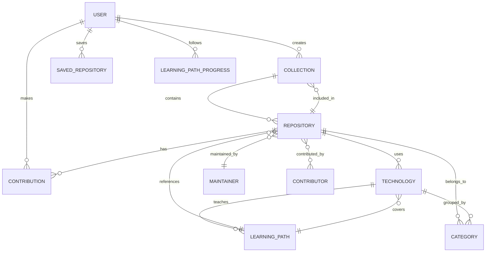

# StackLoop Information Architecture Specification

## 1. Product Overview

StackLoop is an AI-powered developer discovery platform for finding, understanding, learning from, and contributing to open-source projects.

### Core Product Goal
Help developers move from discovery to understanding to contribution with as little friction as possible.

### IA Principles
- Minimize cognitive load
- Keep common actions within 3 clicks
- Make discovery feel guided, not overwhelming
- Support desktop, tablet, and mobile with the same information hierarchy
- Separate browsing, learning, and contribution into clearly distinct experiences
- Design for future expansion without breaking the core navigation model

---

## 2. Product Hierarchy

StackLoop should be organized as a product system with one primary goal: help developers find relevant open-source work.

### Top-Level Hierarchy

```text
StackLoop
├── Discover
│   ├── Repositories
│   ├── Technologies
│   ├── Categories
│   ├── Collections
│   └── Recommendations
├── Learn
│   ├── Learning Paths
│   ├── Guided Guides
│   ├── Technology Roadmaps
│   └── Repository Tutorials
├── Contribute
│   ├── Contribution Opportunities
│   ├── Beginner-Friendly Issues
│   ├── Maintainer Matchmaking
│   └── Contribution History
├── Personal
│   ├── Dashboard
│   ├── Saved Repositories
│   ├── Collections
│   ├── Activity Feed
│   └── Profile
├── Insights
│   ├── Repository Health
│   ├── Ecosystem Trends
│   ├── Skill Growth
│   └── Recommendation Explanations
└── Admin / Platform Tools
    ├── Settings
    ├── Integrations
    └── Maintainer Tools
```

### Hierarchy Rationale
- Discover is the primary entry point for most users.
- Learn and Contribute are adjacent to discovery because they support the path from interest to action.
- Personal is the workspace for saved content, progress, and repeat engagement.
- Insights provides explainability and trust for AI-generated recommendations.
- Platform Tools remain secondary and should not crowd the core product experience.

---

## 3. Site Map

### Primary Site Map

```text
Home
├── Explore
│   ├── Repositories
│   │   ├── Trending
│   │   ├── Personalized
│   │   ├── New & Rising
│   │   ├── By Technology
│   │   ├── By Category
│   │   └── By Difficulty
│   ├── Technologies
│   │   ├── Index
│   │   ├── Detail Pages
│   │   └── Related Repositories
│   ├── Categories
│   │   ├── Index
│   │   └── Detail Pages
│   └── Collections
│       ├── Curated Collections
│       └── User Collections
├── Learn
│   ├── Learning Paths
│   │   ├── Index
│   │   └── Detail Pages
│   ├── Guides
│   └── Tutorials
├── Contribute
│   ├── Opportunities
│   ├── Beginner-Friendly Issues
│   ├── Matchmaking
│   └── Contribution Progress
├── Dashboard
│   ├── Overview
│   ├── Recommendations
│   ├── Saved
│   ├── Activity
│   └── Settings
├── Search
│   ├── Repositories
│   ├── Technologies
│   ├── Maintainers
│   ├── Contributors
│   ├── Categories
│   └── Collections
├── Account
│   ├── Sign In
│   ├── Sign Up
│   ├── Onboarding
│   └── Profile
└── Repository Pages
    ├── Overview
    ├── Insights
    ├── Learn
    ├── Contribute
    ├── Activity
    └── Related
```

### Sitemap Design Principles
- Keep the homepage lightweight and action-oriented.
- Use topic-specific landing pages to reduce cognitive load.
- Allow users to reach any core destination in 2 steps from the main navigation.
- Keep search as a global utility rather than a standalone destination.

---

## 4. Navigation Structure

### 4.1 Primary Navigation

Primary navigation should remain simple and persistent across the product.

| Area | Purpose | Why it exists |
|---|---|---|
| Discover | Explore repositories, technologies, categories, and recommendations | This is the core product loop and should be the most prominent destination |
| Learn | Access guided learning experiences and onboarding content | Supports the platform’s educational value proposition |
| Contribute | Find contribution opportunities and match with projects | Converts discovery into action |
| Dashboard | Personal workspace for saved items, activity, and progress | Gives users a home base and continuity |
| Search | Fast entry into any entity type | High-frequency utility and critical for scale |

### Recommended Primary Navigation Labels
- Discover
- Learn
- Contribute
- Dashboard
- Search

### 4.2 Secondary Navigation

Secondary navigation appears within each major section.

| Section | Secondary Navigation |
|---|---|
| Discover | Overview, Repositories, Technologies, Categories, Collections, Recommendations |
| Learn | Paths, Guides, Tutorials, Skill Tracks |
| Contribute | Opportunities, Starter Issues, Matchmaking, History |
| Dashboard | Overview, Saved, Activity, Collections, Settings |

### Why Secondary Navigation Exists
- It helps users understand the sub-areas of each major product domain.
- It reduces the need for deep drill-downs.
- It creates a predictable pattern across desktop, tablet, and mobile.

### 4.3 Context Navigation

Context navigation should appear inside entity-specific experiences such as repositories, technologies, and learning paths.

Examples:
- Repository page: Overview, Insights, Learn, Contribute, Activity, Related
- Technology page: Overview, Repositories, Learning Paths, Contributors, Trends
- Learning path page: Overview, Modules, Projects, Progress

### Why Context Navigation Exists
- It keeps each content object self-contained.
- It supports efficient movement within a single subject area.
- It allows the IA to scale as new content modules are added.

### 4.4 Breadcrumb Strategy

Breadcrumbs should be used on deeper pages to reinforce location and reduce orientation loss.

Recommended pattern:

```text
Home / Discover / Repositories / JavaScript / React / Repository Name
```

### Breadcrumb Rules
- Show the full user path, not just the current page.
- Keep the breadcrumb shallow and readable.
- Avoid breadcrumb overload on mobile.
- Use the current page as the terminal node.

---

## 5. Entity Relationship Model

StackLoop is built around a network of interrelated content entities.



### Entity Definitions

| Entity | Purpose | Key Relationship |
|---|---|---|
| User | Individual developer using the platform | Follows learning paths, saves repositories, contributes |
| Repository | Open-source project entry | Linked to technologies, categories, maintainers, contributors |
| Technology | Programming language, framework, or ecosystem | Groups repositories and learning content |
| Category | High-level content grouping such as AI, DevTools, Backend | Organizes repository discovery |
| Learning Path | Guided curriculum for learning a topic or stack | References repositories and technologies |
| Collection | Curated group of repositories or learning items | Created by users or editors |
| Maintainer | Project owner or maintainer | Owns repositories and contributes context |
| Contributor | Person who contributes to a repo or platform | Connected to repository contribution activity |

### IA Implication
These entities should each have a dedicated detail page and be cross-linked to support discoverability across the platform.

---

## 6. Repository Information Architecture

The repository page is the most important content page in the product. It should be structured to support three user intents:
- Understand the repository quickly
- Decide whether it is relevant
- Learn or contribute with confidence

### Repository Page Structure

```text
Repository Page
├── Header
│   ├── Name and description
│   ├── Primary actions
│   ├── Repository metadata
│   └── Status indicators
├── Summary Layer
│   ├── AI summary
│   ├── Why it matters
│   ├── Best for
│   └── Quick takeaways
├── Context Layer
│   ├── Technologies
│   ├── Categories
│   ├── Maintainer info
│   ├── Activity and health
│   └── Related projects
├── Learning Layer
│   ├── Beginner guide
│   ├── Learning path links
│   ├── Documentation highlights
│   └── Suggested next steps
├── Contribution Layer
│   ├── Good first issues
│   ├── Contribution fit
│   ├── Skill requirements
│   └── Contribution checklist
├── Community Layer
│   ├── Contributors
│   ├── Ecosystem context
│   └── Maintainer notes
└── Related Content
    ├── Similar repositories
    ├── Complementary technologies
    └── Curated collections
```

### Recommended Information Priority

| Priority | Content Type | Reason |
|---|---|---|
| 1 | Repository summary and quick actions | Users need immediate understanding and action |
| 2 | Tech stack, fit, and value proposition | Helps decide relevance |
| 3 | Learning and contribution guidance | Supports onboarding and participation |
| 4 | Activity, health, and maintainer context | Builds trust and confidence |
| 5 | Related content | Encourages deeper exploration |

### Repository Page Navigation Tabs
- Overview
- Insights
- Learn
- Contribute
- Activity
- Related

### Why This Structure Works
- It balances product storytelling with functional utility.
- It supports both passive discovery and active contribution.
- It avoids overwhelming users with raw project metadata before meaning is established.

---

## 7. Dashboard Architecture

The dashboard should serve as the user’s personal operating center. It should feel focused, useful, and highly personalized without becoming cluttered.

### Dashboard Structure

```text
Dashboard
├── Overview
│   ├── Recommended for you
│   ├── Recently viewed
│   ├── Saved repositories
│   ├── Learning progress
│   └── Contribution opportunities
├── Collections
│   ├── My collections
│   ├── Followed collections
│   └── Create new collection
├── Activity
│   ├── Recent interactions
│   ├── Recommendations history
│   └── Contribution history
├── Settings
│   ├── Preferences
│   ├── Interests and goals
│   ├── Notifications
│   └── Integrations
└── Profile
    ├── Skills
    ├── Goals
    ├── Maintainer status
    └── Contribution history
```

### Dashboard Content Blocks
- Recommended repositories
- Learning paths in progress
- Saved projects
- Contribution opportunities tailored to the user’s profile
- Personalized summaries and explanations

### Dashboard IA Principle
The dashboard should prioritize momentum and continuity. Users should immediately see what is relevant now, not a generic overview of everything.

---

## 8. Search Architecture

Search should be a fast, high-confidence entry point to all primary content types.

### Search Scope
Search should support:
- Repositories
- Technologies
- Maintainers
- Contributors
- Categories
- Collections

### Search Experience Model

```text
Global Search
├── Search Input
├── Instant Suggestions
├── Result Groups
│   ├── Repositories
│   ├── Technologies
│   ├── People
│   ├── Categories
│   └── Collections
└── Filters
    ├── By type
    ├── By difficulty
    ├── By technology
    └── By activity
```

### Search Ranking Logic
Search results should be ranked by:
- Relevance to query
- User profile and recent activity
- Repository popularity and recency
- Match strength to current learning or contribution goals

### Search UX Rules
- Show a clear result type for every item.
- Provide a fast path to the most relevant entity.
- Surface filters before the user has to drill down.
- Support keyword, topic, and intent-based exploration.

---

## 9. Scalability Strategy

The IA must support future features without requiring a restructuring of the main navigation.

### Scaling Principles
- Use a stable core navigation model with modular content layers.
- Treat entities as first-class content types that can expand over time.
- Keep the experience centered on the user’s goal rather than the product feature list.
- Introduce new product capabilities as adjacent modules rather than new top-level domains.

### Future Expansion Map

| Future Feature | IA Placement |
|---|---|
| Organizations | Added under Dashboard as an account-level context layer |
| Teams | Added under Organizations or Personal workspace |
| Browser Extension | Treated as an entry surface, not a new navigation branch |
| Mobile App | Supports the same primary IA with a condensed navigation model |
| Public API | Added under Developer / Integrations in Settings |
| AI Copilot | Added as an assistant layer inside Discover, Learn, and Contribute |
| Marketplace | Added as an extension of Discover or a dedicated vertical later |

### Recommended IA Pattern for Growth
```text
Core Shell
├── Discover
├── Learn
├── Contribute
├── Dashboard
└── Search

Future capabilities extend through:
├── Contextual modules
├── Personal workspaces
├── Assistant surfaces
├── Developer integrations
└── Enterprise/organizational layers
```

### Why This Scales Well
- The IA is built around user intent, not feature silos.
- New capabilities can fit into existing flows.
- The information model can grow without breaking simple navigation patterns.

---

## 10. Implementation Notes

### Navigation Rules for Product Teams
- Keep the main navigation to 5 primary items.
- Avoid nesting beyond 2 levels in the core experience.
- Prioritize search and recommendations for fast engagement.
- Ensure every core object has a dedicated detail page.
- Use consistent tab structures across repository, technology, and learning content.

### Content Model Guidance
- Every entity should have: overview, related content, actions, and metadata.
- Every experience should support: discover, understand, act, and revisit.
- The product should feel like a guided operating system for open-source exploration, not a static content archive.

---

## 11. Recommended IA Summary

The best IA for StackLoop is a product architecture built around four core user motions:
1. Discover relevant repositories
2. Understand why they matter
3. Learn how to engage with them
4. Contribute with confidence

This structure creates a clean product experience that is easy to scale, easy to navigate, and highly aligned with the platform’s mission.
