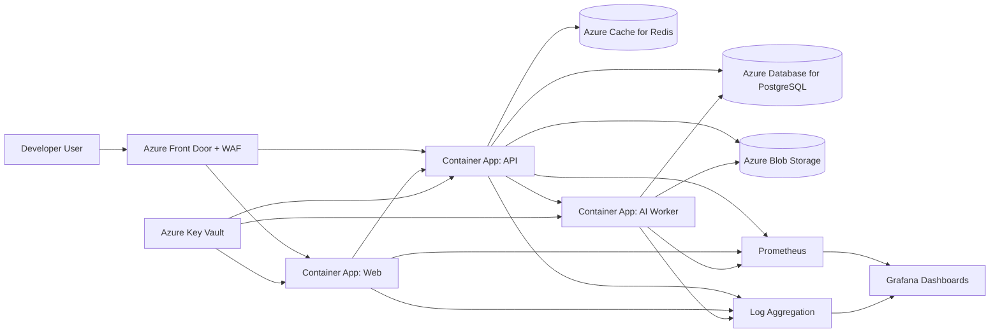
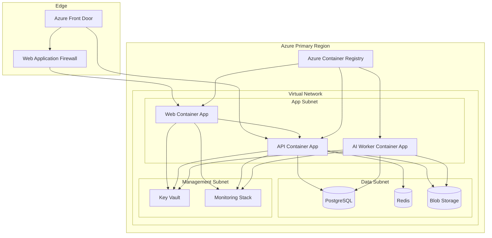

# StackLoop Production Infrastructure Specification

## 1. Purpose

This document defines a production-grade Azure infrastructure design for StackLoop using Docker containers, Azure Container Apps, PostgreSQL, Redis, Azure Blob Storage, Prometheus, Grafana, secure networking, DNS, SSL, backups, scaling, and disaster recovery.

The design is intended for real production workloads, strong availability, operational visibility, and secure deployment practices.

---

## 2. Architecture Goals

The infrastructure must support:

- High availability for web, API, and background processing workloads
- Secure and predictable access to application services
- Fast deployment of containerized services
- Strong observability with metrics and logs
- Isolated, resilient data services
- Scalable handling of organic growth and traffic spikes
- Clear disaster recovery and backup procedures

---

## 3. Platform Summary

### Core Services
- Hosting: Azure
- Containers: Docker
- Compute: Azure Container Apps
- Database: Azure Database for PostgreSQL
- Cache: Azure Cache for Redis
- Storage: Azure Blob Storage
- Monitoring: Prometheus + Grafana
- Logging: Grafana Loki or Azure Monitor-based log ingestion
- Secrets: Azure Key Vault
- Networking: Azure Virtual Network, Private Endpoints, Azure Front Door, WAF
- DNS and SSL: Azure DNS + Front Door / App Gateway certificates

---

## 4. High-Level Production Architecture

---

## 5. Component-by-Component Explanation

### 5.1 Azure Front Door + WAF
Azure Front Door acts as the global entry point for the platform. It handles secure TLS termination, global routing, health checking, and layer 7 protection. The WAF adds protection against common web attacks such as SQL injection, XSS, and bot traffic.

Why it matters:
- Improves security at the edge
- Provides global acceleration and failover readiness
- Keeps the application behind a clean public entry surface

### 5.2 Azure Container Apps
Azure Container Apps hosts the application services as containerized workloads. This is a good fit for StackLoop because the platform includes a web frontend, an API backend, and asynchronous AI workers.

Why it matters:
- Simplifies container hosting without full Kubernetes management
- Supports autoscaling and revision-based deployment
- Integrates well with secrets, ingress, and environment variables

### 5.3 Container App Environments
Each production environment should be isolated in its own Container Apps environment. This prevents cross-application coupling and supports environment-level scaling, networking, and configuration boundaries.

Recommended split:
- dev
- staging
- prod

### 5.4 Azure Database for PostgreSQL
PostgreSQL is the system of record for users, repositories, recommendations, collections, learning paths, analytics events, and application state.

Why it matters:
- Strong relational modeling support
- Mature tooling and ecosystem support
- Suitable for complex app relationships and transactional workloads

Recommended production setup:
- Private networking only
- Backups enabled with point-in-time recovery
- Multi-zone or high-availability configuration where supported
- Connection pooling via PgBouncer or a managed pooler if required

### 5.5 Azure Cache for Redis
Redis handles caching, session acceleration, rate limiting, queues, and frequently accessed read paths.

Why it matters:
- Reduces load on PostgreSQL
- Improves response time for high-traffic read operations
- Supports burst handling and short-lived stateful workflows

Recommended production setup:
- Private endpoint access only
- Persistence enabled for resilience
- Separate logical usage for cache vs queueing if needed

### 5.6 Azure Blob Storage
Blob Storage holds large binary objects such as repository screenshots, generated images, AI output artifacts, exported reports, and uploaded content.

Why it matters:
- Scales cheaply for large content
- Supports lifecycle management and versioning
- Decouples storage from compute services

Recommended configuration:
- Private endpoint access
- Versioning enabled
- Lifecycle rules for old content cleanup
- Soft delete enabled

### 5.7 Azure Key Vault
Key Vault stores secrets, API keys, TLS certificate material, service credentials, database credentials, and signing secrets.

Why it matters:
- Removes secrets from code and deployment manifests
- Enables rotation and centralized governance
- Supports managed identity integration for secure access

### 5.8 Prometheus
Prometheus collects metrics from the web app, API, AI workers, and infrastructure components. It is the primary time-series metrics source for service health and performance.

Why it matters:
- Standardized metrics collection
- Good fit for alerting and service-level dashboards
- Works well with containerized workloads

### 5.9 Grafana
Grafana provides dashboards and alert visualization. It should be used for application health, latency, error rates, resource consumption, and business KPIs.

Why it matters:
- Centralized operational visibility
- Useful for cross-team monitoring and incident response
- Easy to connect to Prometheus and log sources

### 5.10 Logging Layer
Production logging should be centralized using a log aggregation backend such as Grafana Loki, Azure Monitor Logs, or an ELK-compatible stack.

Why it matters:
- Enables troubleshooting and forensic review
- Makes audit trails available when needed
- Helps correlate app errors with infrastructure events

### 5.11 DNS and SSL
DNS should route public traffic through Azure DNS or a managed DNS provider. SSL should be terminated at the edge using Azure Front Door or an Application Gateway with certificates managed centrally.

Why it matters:
- Secure HTTPS by default
- Enforces trust and consistency for production traffic
- Reduces certificate sprawl and manual renewal issues

---

## 6. Deployment Topology

### Production Topology Overview

### Topology Notes
- Public traffic enters through Azure Front Door.
- Container Apps sit in an application subnet and receive traffic from the edge layer.
- Data services are placed in private subnets and accessible only through private endpoints or internal routing.
- Secrets are retrieved from Key Vault using managed identities.
- Container images come from Azure Container Registry and are deployed into Container Apps.

---

## 7. Networking Design

### 7.1 Network Layout
A production deployment should use a dedicated Virtual Network with the following subnets:

- Ingress subnet: public edge and load balancing components
- Application subnet: Container Apps environment and app workloads
- Data subnet: PostgreSQL, Redis, and private storage access
- Management subnet: monitoring, Key Vault private endpoints, administration access

### 7.2 Private Endpoints
All sensitive services should be exposed via private endpoints rather than public IPs:

- PostgreSQL private endpoint
- Redis private endpoint
- Blob Storage private endpoint
- Key Vault private endpoint

This minimizes the public attack surface and strengthens compliance posture.

### 7.3 DNS Design
Use private DNS zones for internal name resolution:
- privatelink.postgres.database.azure.com
- privatelink.redis.cache.windows.net
- privatelink.blob.core.windows.net
- privatelink.vaultcore.azure.net

Public DNS should resolve the application domain to Azure Front Door.

### 7.4 SSL Design
TLS should be terminated at the edge and enforced for all client requests.

Recommended setup:
- Azure Front Door provides HTTPS termination and certificate management
- Redirect HTTP to HTTPS
- Enforce HSTS headers
- Use managed certificates or centralized certificate management

### 7.5 Network Security Recommendations
- Network security groups restrict inbound and outbound communication by service role
- Deny all ingress by default except required paths
- Allow only Container Apps and approved services to speak to PostgreSQL and Redis
- Use Azure Firewall or a secure NAT path if egress needs stronger control

---

## 8. Container Deployment Model

### Application Services
The production deployment should include at least the following services:

- Web frontend container
- API backend container
- AI worker or ingestion worker container
- Optional background job worker container for sync tasks

### Container Build and Release Flow
1. Developers push code to source control
2. CI pipeline builds Docker images
3. Images are pushed to Azure Container Registry
4. Deployment pipeline updates Container Apps revisions
5. Health checks verify readiness
6. Traffic shifts gradually when using revision-based deployment strategies

### Recommended Deployment Strategy
- Blue/green or canary deployment per service
- Use separate revisions for controlled rollout
- Keep rollback simple and automated

---

## 9. Data Architecture

### 9.1 PostgreSQL
PostgreSQL will be the primary transactional database.

It should host:
- users and authentication state
- repositories and metadata
- recommendations and collections
- learning paths and contributions
- audit logs and operational data

### 9.2 Redis
Redis should support:
- caching of frequently accessed repository content
- session acceleration
- rate limiting counters
- transient job state
- short-lived queues

### 9.3 Blob Storage
Blob Storage should store:
- screenshots and rich media assets
- generated AI output files
- exported reports and snapshots
- large content attachments

---

## 10. Monitoring and Observability

### 10.1 Metrics
Collect metrics for:
- request volume
- latency
- error rates
- CPU and memory usage
- database connections and query time
- Redis hit ratio and memory usage
- blob storage operations

### 10.2 Logging
Centralize logs from:
- web and API containers
- worker and ingestion services
- PostgreSQL and Redis diagnostics
- ingress and edge requests

### 10.3 Alerting
Create alerts for:
- elevated 5xx response rates
- high latency or saturation
- failed health checks
- database connection pressure
- Redis memory pressure
- certificate expiry warnings
- unusual authentication failures

### 10.4 Grafana and Prometheus
Prometheus should scrape container and service metrics. Grafana should visualize them and allow operators to quickly assess the health of the production system.

Recommended dashboard categories:
- application overview
- infrastructure health
- API performance
- database health
- Redis performance
- error trend analysis

---

## 11. Security and Secret Management

### Security Controls
- All external traffic is routed through Azure Front Door and WAF
- HTTPS is enforced for all public endpoints
- Secrets are managed by Azure Key Vault
- Managed identity is used for service-to-service access
- Network access to data services is restricted to private endpoints
- Container Apps run with least-privilege permissions

### Secret Sources
- database credentials
- OAuth client secrets
- API keys for third-party services
- signing keys
- TLS private key material

### Security Principles
- No secrets in source control
- Regular rotation of secrets
- Audit access to sensitive services
- Restrict admin access to protected management paths

---

## 12. Scaling Strategy

### Horizontal Scaling
Container Apps should support horizontal scaling based on:
- CPU percentage
- memory usage
- request concurrency
- queue backlog

Recommended settings:
- Minimum replicas: 2 for production web/API services
- Maximum replicas: configurable by workload
- Scale-out thresholds: CPU > 65% for 5 minutes
- Scale-in thresholds: CPU < 30% for 10 minutes

### Vertical Scaling
Increase CPU and memory for services that show sustained growth. This should be done based on trend data rather than reactive incidents.

### Background Workload Scaling
AI workers and ingestion jobs should scale independently from the web/API paths. They should consume queues or background jobs rather than block user-facing traffic.

---

## 13. Backup and Recovery Strategy

### PostgreSQL Backups
- Enable automated daily backups
- Enable point-in-time recovery
- Retain a sufficient backup window for restoration needs
- Test restores periodically

### Redis Backups
- Enable persistence features if supported by the chosen tier
- Back up configuration and important cache-derived state where necessary
- Treat Redis as a cache first, not the only source of truth

### Blob Storage Backups
- Enable versioning and soft delete
- Apply lifecycle policies to manage retention
- Protect important content from accidental deletion

### Application Configuration Backup
- Store infrastructure definitions in source control
- Keep deployment manifests and environment templates versioned
- Maintain disaster recovery documentation for deployment procedures

---

## 14. Disaster Recovery Design

### Recovery Objective
The production design should target:
- RTO: 1 to 4 hours for core service restoration
- RPO: 15 to 60 minutes for critical data depending on workload criticality

### Multi-Region Strategy
For a higher assurance production deployment, StackLoop should be designed with a primary and secondary Azure region.

Primary region:
- Active production environment
- Handles all user traffic

Secondary region:
- Standby environment
- Hosts replicated data services and warm application replicas

### Disaster Recovery Components
- Cross-region backup of PostgreSQL data
- Replica or standby database in secondary region
- Replicated container image availability via Azure Container Registry geo-replication
- Front Door or DNS failover to secondary region
- Rehydration process for Blob Storage backup or replication

### Failover Plan
1. Detect incident and declare failover
2. Promote secondary data services if required
3. Switch DNS or Front Door routing to the secondary region
4. Reconcile application and background workers
5. Validate health, data integrity, and user access
6. Re-enable primary traffic after incident mitigation

---

## 15. Recommended Azure Resource Layout

### Resource Groups
- rg-stackloop-prod
- rg-stackloop-network
- rg-stackloop-monitoring
- rg-stackloop-data
- rg-stackloop-security

### Core Azure Resources
- Azure Front Door
- Azure Container Apps Environment
- Azure Container Registry
- Azure Database for PostgreSQL
- Azure Cache for Redis
- Azure Blob Storage account
- Azure Key Vault
- Log analytics workspace or monitoring backend
- Private DNS zones
- Virtual Network and subnets

---

## 16. Production Readiness Checklist

- Public traffic is routed through a secure edge layer
- TLS is enforced everywhere
- Data services are private and not exposed publicly
- Secrets are stored in Key Vault and rotated regularly
- Prometheus and Grafana are deployed for observability
- Alerts exist for critical service and infrastructure failures
- Backups and point-in-time restore are enabled
- Disaster recovery playbooks are documented and tested
- Autoscaling thresholds are defined for each workload
- Rollback and deployment safety controls are in place

---

## 17. Final Recommendation

For StackLoop, the most production-suitable Azure architecture is a layered model with Azure Front Door and WAF at the edge, Azure Container Apps for service hosting, Azure Database for PostgreSQL for transactional persistence, Azure Cache for Redis for fast state and caching, Azure Blob Storage for large media and artifacts, Azure Key Vault for secrets, and Prometheus plus Grafana for operational visibility.

This design gives StackLoop a secure, scalable, observable, and resilient production foundation while remaining practical to operate and evolve over time.
