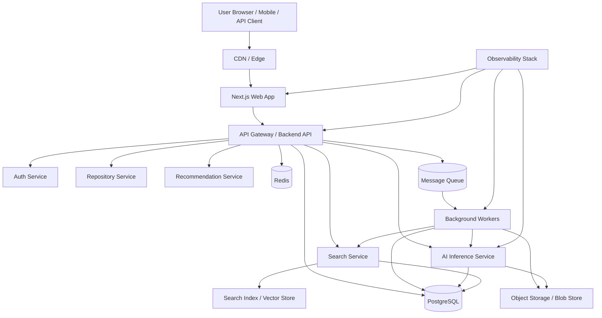
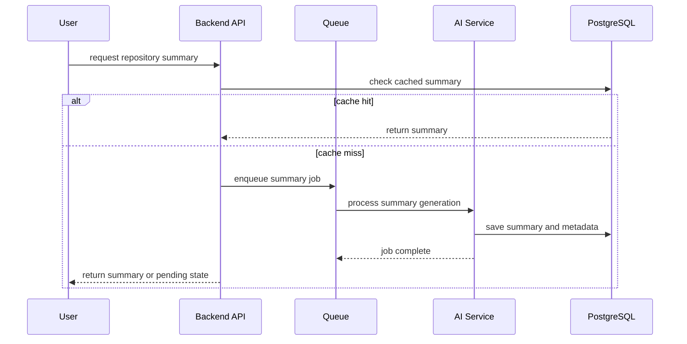
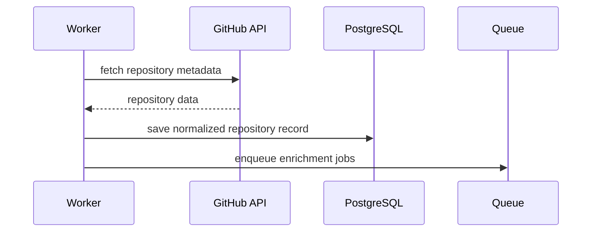
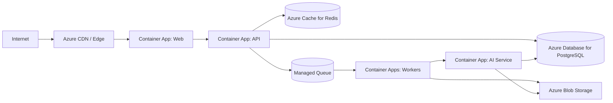
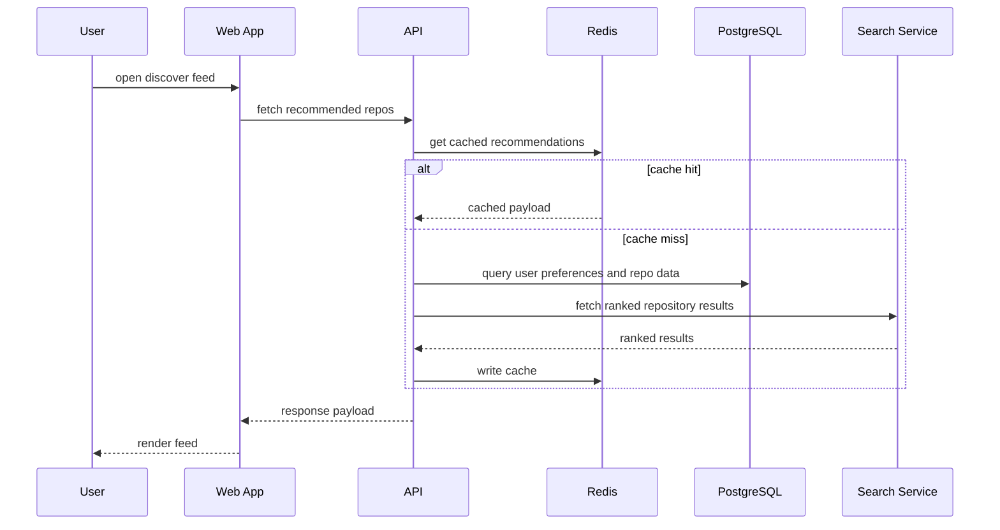
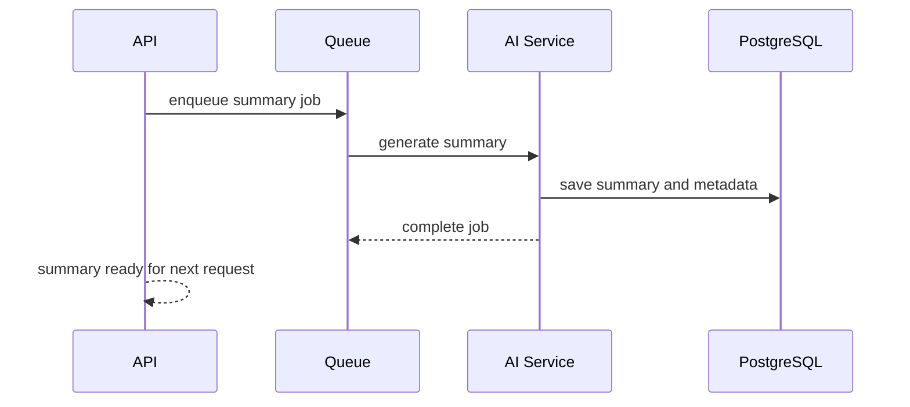
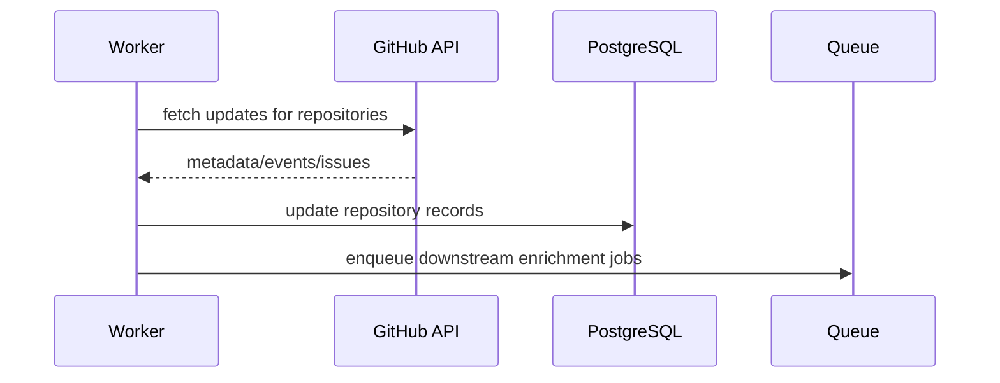

# StackLoop System Architecture Specification

## 1. Architecture Overview

StackLoop is a high-scale developer discovery platform that combines a modern web frontend, a distributed backend API, an AI intelligence service, background processing, and a data platform designed for repository-scale intelligence.

### Design Goals
- Support millions of repositories and hundreds of thousands of users
- Provide low-latency discovery experiences
- Scale horizontally for bursts in traffic and ingestion
- Keep observability and reliability first-class concerns
- Make AI processing asynchronous and resilient
- Enable future growth into organizations, teams, public APIs, and mobile clients

### Core Architectural Pillars
- Stateless application services wherever possible
- Event-driven background processing for expensive work
- Strong separation between read and write workloads
- Cache-first access for hot discovery experiences
- Robust observability through logs, metrics, traces, and alerts

---

## 2. High-Level Architecture



### Layer Responsibilities
- Web App: user-facing experience for discovery, learning, and contribution workflows
- Backend API: domain logic, user account operations, repository and recommendation services
- AI Service: summarization, insight generation, learning path generation
- Queue and Workers: expensive and asynchronous tasks such as ingestion, indexing, recommendation refreshes
- Data Layer: PostgreSQL for transactional data, Redis for caching and low-latency access, object storage for large assets
- Observability Layer: monitoring, logging, tracing, and alerting

---

## 3. Service Architecture

### 3.1 API Gateway

Purpose: Entry point for all public and internal client traffic.

Responsibilities:
- Route requests to the appropriate internal services
- Enforce authentication and authorization
- Rate limit abusive traffic
- Aggregate responses where needed
- Provide a consistent API contract

Why it exists:
- Centralizes request handling and cross-cutting concerns
- Simplifies frontend integration and platform growth
- Improves observability and policy enforcement

### 3.2 Auth Service

Purpose: Identity, session, and permission handling.

Responsibilities:
- GitHub OAuth integration
- Session management
- Token validation and refresh
- User role and permissions enforcement
- Account linking and provider reconciliation

Why it exists:
- Auth is shared across web, API, and future client surfaces
- It prevents auth logic from being scattered across services

### 3.3 Repository Service

Purpose: Manage repository metadata, ownership, health, and content retrieval.

Responsibilities:
- Repository CRUD and lookup operations
- Enrichment of repository data from GitHub metadata
- Maintainer and contributor relationship mapping
- Repository health signals and contribution readiness

Why it exists:
- Repository data is central to the platform and must be consistent across surfaces

### 3.4 Search Service

Purpose: Provide fast search across repositories, technologies, maintainers, contributors, categories, and collections.

Responsibilities:
- Keyword search
- Filtered browsing and faceted discovery
- Ranking and relevance tuning
- Search result enrichment
- Optional semantic and vector-based retrieval

Why it exists:
- Search is a core product capability and a high-traffic path
- It needs dedicated scaling and relevance tuning

### 3.5 Recommendation Service

Purpose: Generate and serve personalized discovery experiences.

Responsibilities:
- Personalized repository ranking
- Recommendation generation based on profile and behavior
- Explaining why a result is shown
- Continuous learning from user interactions

Why it exists:
- Discoverability is a core product differentiator
- Recommendation logic needs to be isolated from the UI and API layer

### 3.6 Insight Service

Purpose: Provide AI-generated summaries and repository intelligence.

Responsibilities:
- Repository summaries
- Technology landscape mapping
- Learning path suggestions
- Contribution opportunity insights
- AI explanation and trust layers

Why it exists:
- The platform’s AI value proposition requires dedicated service boundaries and model orchestration

### 3.7 Content Ingestion Service

Purpose: Pull repository data from external ecosystems and prepare it for indexing and intelligence generation.

Responsibilities:
- Pull repository metadata from GitHub and other sources
- Normalize and deduplicate content
- Trigger enrichment and summarization jobs
- Update search indexes and recommendation inputs

Why it exists:
- Ingestion is a high-volume, asynchronous workflow that should not block user requests

---

## 4. Frontend Architecture

### Frontend Stack
- Next.js for the primary web app
- TypeScript for correctness and maintainability
- Tailwind CSS for styling
- App router for route-based composition
- Server components for data-heavy pages where appropriate
- Client components for interactive surfaces such as filters, modals, and search input

### Frontend Responsibilities
- Render the user journey from landing to repository detail and contribution flows
- Consume API and internal service endpoints
- Handle loading, empty, error, and offline states gracefully
- Maintain a responsive experience across desktop, tablet, and mobile

### Frontend Architecture Pattern
```text
apps/web/
├── app/
├── components/
├── features/
├── lib/
├── hooks/
├── services/
└── styles/
```

### Frontend Design Principles
- Use server components for content-rich routes
- Keep pages thin and compose feature-level components
- Use route-level loading and error boundaries
- Cache stable data with ISR or revalidation when appropriate

### Frontend Scalability Considerations
- Use edge caching for static and semi-static content
- Prefetch key content and optimize bundle size
- Decompose the UI into feature-oriented modules instead of monolithic pages

---

## 5. Backend Architecture

### Backend Stack
- Node.js with Express.js for the primary API layer
- TypeScript for strong typing and maintainability
- REST API for external client integration
- Internal service-to-service communication over HTTP or message queues

### Backend Responsibilities
- Expose API endpoints for discovery, recommendations, account management, and repository operations
- Enforce business rules and authorization
- Coordinate access to PostgreSQL, Redis, and other services
- Schedule and coordinate asynchronous jobs

### Backend Runtime Pattern
```text
apps/api/
├── src/
│   ├── routes
│   ├── controllers
│   ├── services
│   ├── middleware
│   ├── repositories
│   ├── workers
│   └── utils
```

### Backend Design Principles
- Keep controllers thin
- Use service classes for domain behavior
- Use repository abstractions for data access
- Make business rules testable in isolation
- Do not embed AI or queue orchestration in controllers

### API Layer Strategy
- Public APIs: versioned REST endpoints for web app and future clients
- Internal APIs: service-to-service endpoints for internal platform services
- Gateway layer: handles auth, rate limits, and standardization

---

## 6. AI Service Architecture

### AI Stack
- Python with FastAPI
- LLM orchestration layer
- Prompt and response management
- Optional vector store and embedding pipeline

### AI Service Responsibilities
- Generate repository summaries from repository metadata and documentation
- Create explanation cards and technology insights
- Generate learning path suggestions and contribution guidance
- Build embeddings for semantic search and recommendation workflows

### AI Service Runtime Pattern
```text
services/ai/
├── app/
│   ├── api
│   ├── services
│   ├── prompts
│   ├── models
│   └── main.py
```

### AI Architecture Principles
- Treat AI as an asynchronous and bounded service
- Cache outputs where appropriate
- Do not make the primary user experience depend on synchronous AI inference for every request
- Maintain structured fallbacks for incomplete or low-confidence outputs

### AI Processing Flow


### AI Reliability Strategy
- Use retries with exponential backoff
- Store outputs in PostgreSQL or object storage
- Fallback to rule-based summaries when model output is poor
- Track token usage, latency, and failure rates

---

## 7. Database Architecture

### Primary Database
- PostgreSQL

### Why PostgreSQL
- Strong relational model for users, repositories, technologies, collections, and contributions
- Excellent support for transactional consistency
- Good fit for domain correctness and complex relationships

### Core Data Domains
- Users
- Repositories
- Technologies
- Categories
- Collections
- Maintainers
- Contributors
- Learning paths
- Recommendations
- Activity and events

### Suggested Logical Model
```text
Users
├── Accounts
├── Profiles
├── Preferences
├── Activity
└── SavedItems

Repositories
├── Metadata
├── Ownership
├── HealthSignals
├── Insights
└── Contributions

Discover
├── Categories
├── Technologies
├── Collections
├── Recommendations
└── SearchIndexState
```

### Database Design Principles
- Use relational tables for authoritative entities
- Keep denormalized copies only where necessary for read performance
- Use id-based references and strong constraints
- Partition large tables where appropriate for activity and event data

### Scaling Strategy
- Read replicas for follower traffic and search-heavy workloads
- Connection pooling with PgBouncer
- Partitioning for large event and activity tables
- Background jobs for heavy writes and index refreshes

---

## 8. Redis Integration

### Role of Redis
Redis is used as a high-speed cache and transient state layer.

### Use Cases
- Cache repository summaries and hot search results
- Cache recommendation payloads for users
- Rate limiting and request throttling
- Session store or session token short-term state
- Queue coordination and ephemeral job state

### Redis Topology
- Primary Redis cluster for hot data
- Optional replica or failover configuration for resilience
- Separate logical namespaces for cache, session, and rate-limit data

### Why Redis Matters
- Improves user-facing latency dramatically
- Reduces load on PostgreSQL during high-traffic discovery workloads
- Supports burst traffic and rapid writes without overloading the primary datastore

---

## 9. External Services

### GitHub API Integration
Purpose: Pull repository metadata, stars, activity, issues, and contribution context from GitHub.

Responsibilities:
- Repository discovery ingestion
- Metadata enrichment and verification
- Issue and pull request metadata retrieval
- Maintainer and contributor graph enrichment

### Integration Pattern


### GitHub API Considerations
- Respect rate limits and use backoff strategy
- Cache responses aggressively for stable entities
- Use webhooks where possible for fast update paths
- Use batch processing for large-scale ingestion

### Other External Services
- Search provider or vector store integration
- LLM provider for AI inference
- Email or notification provider where needed
- Object storage for static artifacts and generated content

---

## 10. Background Workers

### Purpose
Handle expensive or asynchronous tasks that should not block user requests.

### Examples of Worker Jobs
- Repository ingestion and enrichment
- Search indexing updates
- Recommendation refresh jobs
- AI summary generation
- Learning path generation
- Email or notification dispatch
- Analytics event processing

### Worker Architecture
- Stateless workers running in containerized environments
- Consume jobs from a queue system
- Retry and dead-letter failed jobs
- Support horizontal scaling based on queue depth

### Worker Design Principles
- Make workers idempotent
- Track job state and attempt counts
- Use backoff, retry, and circuit-breaking strategy
- Persist job outputs for traceability

---

## 11. Queue System

### Queue Choice
Use a distributed message queue such as RabbitMQ, Kafka, or managed cloud alternatives.

### Recommended Use Cases
- Repository ingestion jobs
- AI generation jobs
- Indexing and recommendation refreshing
- Data synchronization tasks

### Queue Design Principles
- Use topic-based or queue-based patterns depending on workflow needs
- Separate high-priority tasks from background enrichment tasks
- Provide dead-letter queues for failed jobs
- Track queue lag and processing latency

### Example Queue Topology
```text
ingestion-jobs
recommendation-jobs
ai-summary-jobs
search-reindex-jobs
notification-jobs
```

---

## 12. File Storage

### Purpose
Store large uploaded or generated assets such as screenshots, generated content, static exports, and processed documents.

### Storage Recommendation
- Azure Blob Storage or equivalent object storage

### Use Cases
- Repository screenshots or media
- Generated markdown exports
- AI-generated artifacts and embeddings metadata
- Static assets for content delivery

### Design Principles
- Store reference metadata in PostgreSQL and blobs in object storage
- Use signed URLs for direct upload workflows where appropriate
- Keep storage lifecycle policies explicit

---

## 13. Monitoring and Observability

### Monitoring Goals
- Detect regressions and failures quickly
- Understand latency and throughput bottlenecks
- Trace requests across services
- Measure AI inference quality and cost
- Alert on saturation, errors, and degraded availability

### Monitoring Stack
- Metrics: Prometheus + Grafana or equivalent
- Tracing: OpenTelemetry
- Logging: structured logs to a centralized platform
- Alerting: PagerDuty / Azure Monitor / Opsgenie style tooling

### Core Metrics
- API latency and error rate
- Queue depth and consumer lag
- Worker job success and failure rates
- Database connection count and query latency
- Redis memory usage and hit rate
- AI request latency and token usage
- Search latency and result quality metrics

### Structured Logging
Log every request or job with:
- request id
- user id or anonymous id
- action name
- timing information
- status code or job result
- correlation id

### Why Observability Is Critical
- A platform with millions of repos and large traffic requires proactive detection and debugging
- AI and ingestion pipelines especially need strong operational visibility

---

## 14. Deployment Architecture

### Deployment Model
- Containerized services deployed to Azure Container Apps
- Separate services for web app, API, AI service, and workers
- Use managed PostgreSQL and Redis where possible
- Use Azure load balancer and CDN for public traffic

### Deployment Diagram


### Deployment Principles
- Use immutable deployments and versioned rollouts
- Separate environments: development, staging, production
- Use health checks and autoscaling for all major services
- Keep secrets in managed secret stores

### Scaling Strategy
- Web app: autoscale based on CPU, memory, and request rate
- API: autoscale based on request latency and concurrency
- Workers: autoscale based on queue depth
- AI service: autoscale based on inference queue and latency

---

## 15. Sequence Diagrams

## 15.1 Repository Discovery Request



## 15.2 Repository Summary Generation



## 15.3 GitHub Sync Flow



---

## 16. Service Catalog

| Service | Purpose | Primary Dependencies | Scale Pattern |
|---|---|---|---|
| Web App | User-facing UI | API, CDN | Horizontal stateless |
| API Gateway | Entry point | Auth, API services | Horizontal stateless |
| Auth Service | User auth and permissions | PostgreSQL, Redis | Horizontal stateless |
| Repository Service | Repository metadata and ownership | PostgreSQL, GitHub API | Horizontal stateless |
| Search Service | Search and rankings | PostgreSQL, search index, Redis | Horizontal stateless |
| Recommendation Service | Personalized discovery | PostgreSQL, Redis, AI outputs | Horizontal stateless |
| Insight Service | AI summarization and guidance | LLM provider, PostgreSQL, object storage | Horizontal stateless |
| Ingestion Service | Data sync and enrichment | GitHub API, Postgres, Queue | Horizontal workers |
| Worker Pool | Background jobs | Queue, PostgreSQL, object storage | Horizontal workers |

---

## 17. Reliability and Availability Strategy

### Reliability Design Principles
- Stateless services for easier scaling and recovery
- Health checks on every service
- Read replicas and cache layers to reduce database pressure
- Retries and circuit breakers for downstream failures
- Idempotent workers and job monitoring

### High Availability Approach
- Multi-instance deployment for each service
- Load balanced public entry points
- Redundant databases and Redis failover strategies
- Run critical workers in multiple replicas
- Graceful degradation for non-critical AI jobs

### Disaster Recovery
- Regular backups for PostgreSQL
- Restore playbooks for services and data stores
- Separate environment tiers for staging and production
- Infrastructure as code for reproducibility

---

## 18. Security Architecture

### Security Measures
- OAuth-based authentication through GitHub
- Secure secret management for API keys and model credentials
- TLS for all network traffic
- Strict role-based access around internal services
- Rate limiting and abuse detection
- Audit logging of sensitive admin actions

### Why Security Is Built In
- The platform handles account identity, repository metadata, and potentially sensitive contribution data
- Production readiness requires explicit security controls from the start

---

## 19. Observability and SRE Readiness

### Recommended Monitoring Suite
- Metrics: throughput, latency, error budgets, saturation, queue lag
- Logs: structured logs with correlation ids
- Traces: request-to-worker propagation across services
- Dashboards: per-service and platform-wide health overview
- Alerts: critical service degradation, queue backlog, DB saturation, AI provider failures

### Operational Metrics
- p95 latency for feed and search requests
- repository ingestion throughput
- worker success and failure rate
- cache hit rate
- recommendation generation latency
- AI generation latency and failure rate

---

## 20. Final Architecture Summary

StackLoop’s production architecture is designed as a resilient, scalable, and observable platform composed of:
- a high-performance web frontend
- a modular backend API layer
- asynchronous AI and ingestion services
- durable relational storage with Redis caching
- background workers for expensive workflows
- cloud-native deployment on Azure Container Apps

This architecture supports the platform’s growth from early-stage product delivery to a large-scale developer platform serving millions of repositories and hundreds of thousands of users.
